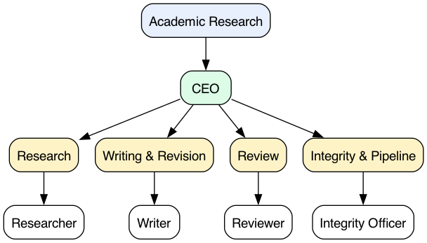

# Academic Research

> **Community port** of [`Imbad0202/academic-research-skills`](https://github.com/Imbad0202/academic-research-skills) (the ARS pipeline) into the [Agent Companies](https://agentcompanies.io) format. **Not affiliated with or endorsed by Imbad0202 or the ARS authors.** Runtime-agnostic via the Paperclip adapter chain — Claude is the reference runtime; Codex, Gemini, OpenCode, Cursor, and others are supported with varying skill polish.

> ⚠️ **Non-commercial use only.** Upstream is licensed **CC BY-NC 4.0** and this port preserves that restriction. Personal research, academic work, and non-commercial collaboration: yes. Commercial services, paid offerings, work-for-hire: no. See [LICENSE](./LICENSE) and [NOTICE](./NOTICE).

5 agents — a CEO who handles intake, orchestration, and escalation, plus 4 stage owners (Researcher, Writer, Reviewer, Integrity Officer) covering the linear ARS pipeline (research → write → review → revise → finalize). The four upstream skill packages are referenced by pinned commit SHA (not vendored); the CEO's coordination skills are port-original.

## Getting Started

```bash
npx companies.sh add stubbi/companies/academic-research
```

See [Paperclip](https://github.com/paperclipai/paperclip) for more information.

## Org chart



## Agents

| Agent | Team | What it does | Skills |
|---|---|---|---|
| **CEO** | _(top-level, port-original)_ | Front of house — intake triage, pipeline orchestration, checkpoint coordination, escalation | 4 |
| **Researcher** | Research | Stage 1 — RQ brief, methodology, S2-verified bibliography, synthesis | 1 |
| **Writer** | Writing & Revision | Stages 2 / 4 / 4' / 5 — outline, draft, revise, re-revise, finalize | 1 |
| **Reviewer** | Review | Stages 3 / 3' — first-round panel + verification re-review | 1 |
| **Integrity Officer** | Integrity & Pipeline | Stages 2.5 / 4.5 / 6 — integrity gates, claim verification, process summary | 1 |

## Skills (4 referenced upstream + 4 port-original)

Upstream-referenced (pinned to commit `58dad47`):

| Skill | Owner | Stages |
|---|---|---|
| `deep-research` | Researcher | 1 |
| `academic-paper` | Writer | 2 / 4 / 4' / 5 |
| `academic-paper-reviewer` | Reviewer | 3 / 3' |
| `academic-pipeline` | Integrity Officer | 2.5 / 4.5 / 6 |

Port-original (CEO-owned, hand-authored, no upstream counterpart):

| Skill | Purpose |
|---|---|
| `intake-triage` | Classify request and route to the right pipeline mode + entry stage |
| `pipeline-orchestration` | Drive the 1 → 2 → 2.5 → 3 → … → 6 state machine; enforce 2-revision-loop cap |
| `checkpoint-coordination` | Surface the 10 decision-heavy + 2 integrity-ack checkpoints; require explicit user confirmation |
| `escalation-routing` | Off-ramp on real blockers (integrity FAIL after retries; reviewer Reject; cap hit; ethics) |

Upstream-referenced `skills/<slug>/SKILL.md` files are thin reference manifests pointing to the pinned-commit file; skill content is fetched on demand by the runtime — nothing is forked or vendored. Port-original `skills/<slug>/SKILL.md` files contain their content inline.

## Boundaries

Nothing in this package constitutes peer-reviewed scholarship on its own. These agents draft research artifacts (literature searches, methodology blueprints, outlines, drafts, review reports, revision plans, formatted manuscripts) for review by a qualified human researcher. They do not submit to journals, sign authorship statements, make editorial decisions, or attest to research integrity on the user's behalf; every output is staged for human sign-off.

The pipeline's two integrity gates (Stage 2.5 pre-review sampling; Stage 4.5 zero-tolerance final check) and the 7-mode AI failure checklist (Lu 2026, *Nature*) are **mandatory and not skippable**. The CEO will refuse to advance the pipeline on a FAIL, even at user request — override is a user decision surfaced as an option, never selected by the agent.

## Provenance

| Field | Value |
|---|---|
| Upstream | [`Imbad0202/academic-research-skills`](https://github.com/Imbad0202/academic-research-skills) |
| Pinned commit | `58dad474572ea63ca7f204d582632acc413a0efd` (v3.7.2, 2026-05-10) |
| Upstream license | CC BY-NC 4.0 |
| Port license | CC BY-NC 4.0 (matches upstream) |

See [`NOTICE`](./NOTICE) for full attribution.

## Maintenance — bumping the upstream SHA

```bash
make bump SHA=<new-upstream-sha>
make test
git diff --stat
git commit -am "chore: bump upstream to <short-sha>"
```

`make bump` rewrites `manifest.yaml`, regenerates all manifests, refetches content hashes for the 4 upstream-referenced skills, and runs `make check`. If any upstream file's content hash has changed, the regenerated `SKILL.md` reflects it — port-original skills are never overwritten.

## Layout

```
academic-research/
├── COMPANY.md                          # generated
├── teams/<slug>/TEAM.md                # generated, ×4
├── agents/<slug>/AGENTS.md             # generated, ×5 (CEO + 4 stage owners)
├── skills/<slug>/SKILL.md              # generated for the 4 upstream-referenced;
│                                       # hand-authored for the 4 port-original
├── manifest.yaml                       # canonical source — edit this, run `make build`
├── scripts/build.py                    # manifest generator (skips port-original SKILL.md)
├── scripts/check.py                    # validator (schema + cross-refs + content hashes)
├── images/                             # org chart (generated)
├── LICENSE                             # CC BY-NC 4.0 (matches upstream)
├── NOTICE                              # upstream attribution
└── tests/                              # pytest — schema validators
```

## License

CC BY-NC 4.0 — see [LICENSE](./LICENSE). **Non-commercial use only.** Top-level catalog wrapper at [stubbi/companies](https://github.com/stubbi/companies) is MIT, but each company carries its own license; this one inherits CC BY-NC 4.0 from upstream.
