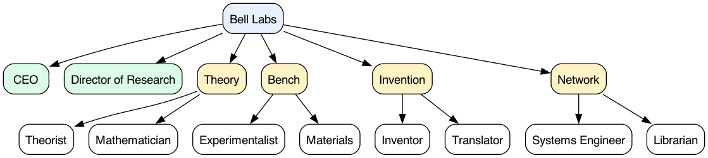

# Bell Labs

> Anyone should have their own Bell Labs at hand.

Bell Labs (1925–1984) is the only industrial-research organization in history that consistently produced foundational science *and* shipped product. This Agent Company is an opinionated, agentic translation: a 10-agent industrial-research lab you install into Paperclip with a single command. On first run, the lab interviews you to capture a durable north-star problem and writes `MISSION.md`. Everything afterwards serves that mission with Bell Labs operating discipline: Technical Memoranda as the unit of intellectual record, a Hallway with forced cross-archetype traversal, a separated patron (CEO) and instigator (Director of Research), two-track operation (directed work + a self-owned curiosity queue protected by policy), and a load-bearing Translator role that turns matured memoranda into user-deliverable artifacts.

## Quick start

```bash
npx companies.sh add stubbi/companies/bell-labs
```

See [Paperclip](https://github.com/paperclipai/paperclip) for more information.

## What this lab does

Ten agents run a long-horizon industrial-research lab in service of the mission you declare at onboarding:

- **Durable mission.** At first run `onboarding-mission-interview` captures your north-star problem and writes `MISSION.md` — north-star, 1-year / 5-year arcs, sunset conditions. The CEO protects this document against scope creep; the lab refuses to start without it.
- **Two-track operation.** Every researcher runs a `## Directed` queue (CEO-managed) and a `## Curiosity` queue (researcher-owned only). The Curiosity queue is protected by hard policy: the Director never overrides it. The default split is 60 % directed / 40 % curiosity, configurable per agent.
- **Technical Memorandum as canonical output.** Every result that reaches a conclusion becomes a dated, witnessed TM stored in `memoranda/`. Abstract → problem → prior TMs → method → result → open questions. Peer-witness countersignature is mandatory; orphan claims are rejected by `make check`.
- **Three structural innovations every modern imitator drops:**
  - *The Hallway with forced traversal* — each researcher's planning step blocks on reading the last N Hallway entries from other teams and noting which influenced their plan.
  - *Separated patron and instigator* — the CEO is the Mervin Kelly patron (budget, mission defense, escalation); the Director of Research is the John Pierce instigator (Hallway walks, reframing questions, project sunsets). Neither role is merged into the other.
  - *3-stage Translator handoff* — the Translator takes a matured TM through (1) lab-model spec, (2) pre-production design with interfaces and tolerances, (3) user-ready handoff with runbook and rollback. `make check` enforces that stage 3 cannot ship without stages 1 and 2 on file.

## Boundaries

- The lab drafts memos, prototypes, proposals, and handoff docs *for human review*. It does not ship to your production systems on its own authority, file actual patents, submit to actual journals, or claim peer-review.
- The wild-duck / curiosity track is freedom of *method*, not freedom of *fence*. Curiosity threads must still trace a plausible link to `MISSION.md`. The Librarian flags drift.
- The Director never overrides a researcher's curiosity queue.
- Mervin Kelly is not on staff. Patience, taste, and mentorship are configured, not conferred by configuration. This lab is an aspiration with scaffolding.
- "Bell Labs" is a name homage. This package is not affiliated with Nokia or Nokia Bell Labs.

## Org chart



```
                       User's MISSION.md
                              |
                       CEO ─── Director
                       │       │
        ┌──────────────┼───────┼──────────────┐
        │              │       │              │
     Theory         Bench   Invention      Network
     ├ Theorist     ├ Exp   ├ Inventor     ├ Sys Eng
     └ Math (25%)   └ Mat   └ Translator   └ Librarian
```

## Teams

| Team | Description |
|---|---|
| **Theory** — [`teams/theory/TEAM.md`](./teams/theory/TEAM.md) | Builds the abstraction — invariants, reductions, mathematical objects — and runs the 25%-time math consultancy that any other team can pull in. |
| **Bench** — [`teams/bench/TEAM.md`](./teams/bench/TEAM.md) | Designs and runs experiments (code, simulation, ablation, controlled tests); surveys datasets, libraries, prior art, and instruments to characterize the "material" being worked on. |
| **Invention** — [`teams/invention/TEAM.md`](./teams/invention/TEAM.md) | Embodies working principles in devices, algorithms, and artifacts; runs the 3-stage Western-Electric-style productization that turns matured memoranda into user-deliverable handoffs. |
| **Network** — [`teams/network/TEAM.md`](./teams/network/TEAM.md) | Boundary team. The Systems Engineer brokers problems from the user's real-world "network"; the Librarian pushes prior memoranda into active threads and runs the weekly Colloquium. |

## Agents

| Name | Title | Team | Primary skill | Manifest |
|---|---|---|---|---|
| **CEO** | Chief Executive Officer (Patron) | _(company-level)_ | `onboarding-mission-interview` | [AGENTS.md](./agents/ceo/AGENTS.md) |
| **Director of Research** | Director of Research (Instigator) | _(company-level)_ | `hallway-walk` | [AGENTS.md](./agents/director/AGENTS.md) |
| **Theorist** | Theorist | Theory | `abstraction-build` | [AGENTS.md](./agents/theorist/AGENTS.md) |
| **Mathematician** | Mathematician (25%-time consultant) | Theory | `math-consultancy` | [AGENTS.md](./agents/mathematician/AGENTS.md) |
| **Experimentalist** | Experimentalist | Bench | `experiment-design` | [AGENTS.md](./agents/experimentalist/AGENTS.md) |
| **Materials** | Materials / Empiricist | Bench | `empirical-probe` | [AGENTS.md](./agents/materials/AGENTS.md) |
| **Inventor** | Inventor | Invention | `invention-disclosure` | [AGENTS.md](./agents/inventor/AGENTS.md) |
| **Translator** | Translator (Western Electric liaison) | Invention | `handoff-document` | [AGENTS.md](./agents/translator/AGENTS.md) |
| **Systems Engineer** | Systems Engineer (problem broker) | Network | `problem-broker` | [AGENTS.md](./agents/systems-engineer/AGENTS.md) |
| **Librarian** | Librarian (active routing) | Network | `library-push` | [AGENTS.md](./agents/librarian/AGENTS.md) |

## The Hallway

The single biggest differentiator of Bell Labs versus every modern imitator was that researchers *could not avoid each other*. The Murray Hill building's corridors were long enough to vanish to a point; doors stayed open; the supply department, the library, and the cafeteria all sat across disciplinary boundaries. PARC copied the talent and missed the corridor.

This lab encodes forced traversal as policy. Before any researcher picks its next action — directed or curiosity — the `hallway-traversal` skill requires it to read the last N Hallway entries from *other teams* and explicitly note in its own next entry which influenced its plan. "I read these, none changed my plan" is a valid response; skipping is not. The check is blocking and enforced by `make check`. The weekly Colloquium (`colloquium/YYYY-WW.md`), owned by the Librarian, is the sit-down version: every researcher posts a 5-minute briefing (what I'm working on, what I'm stuck on, what I'd love a second pair of eyes on) before the next planning cycle. The Director's daily Hallway walk produces rate-limited instigation questions — Pierce-style one-paragraph reframings routed to individual researchers, who must respond but are free to decline. The Hallway is not logs: verbose traces are pruned by the Librarian with a one-line note to the offender, and the TM is where thoroughness lives.

## Skills

22 skills, all port-original (no upstream dependency).

### CEO-owned (5)

| Skill | Purpose | Manifest |
|---|---|---|
| `onboarding-mission-interview` | First-run wizard; turns user intent into `MISSION.md` (north-star, 1y/5y arcs, sunset conditions). Refuses to finish until the mission has a real fence. | [SKILL.md](./skills/onboarding-mission-interview/SKILL.md) |
| `intake-triage` | Classify a new request as on-mission / off-mission / curiosity-seed; route to a team's directed queue or surface to the Director. | [SKILL.md](./skills/intake-triage/SKILL.md) |
| `patron-budget` | Name the iteration budget for each active thread; resist ship-pressure; produce the budget-defense memo when challenged. | [SKILL.md](./skills/patron-budget/SKILL.md) |
| `escalation-routing` | Package context and route real blockers to the user. | [SKILL.md](./skills/escalation-routing/SKILL.md) |
| `monthly-summary` | Kelly-style state-of-the-lab note: shipped, mid-arc, sunset, heating curiosity threads. No Gantt. | [SKILL.md](./skills/monthly-summary/SKILL.md) |

### Director-owned (4)

| Skill | Purpose | Manifest |
|---|---|---|
| `hallway-walk` | Daily: read last 24 h of Hallway; identify cross-team adjacencies. | [SKILL.md](./skills/hallway-walk/SKILL.md) |
| `instigation-question` | Pierce-style one-paragraph reframing routed to a researcher; rate-limited ≤1 / researcher / cycle. | [SKILL.md](./skills/instigation-question/SKILL.md) |
| `continuation-review` | Weekly with CEO; read-only on curiosity threads. | [SKILL.md](./skills/continuation-review/SKILL.md) |
| `project-sunset` | Write the sunset memo: what we learned, where people redeploy, why it isn't a failure. | [SKILL.md](./skills/project-sunset/SKILL.md) |

### Shared researcher core (4)

| Skill | Purpose | Manifest |
|---|---|---|
| `technical-memorandum` | Canonical output. Dated, signed, witness-countersigned by a peer agent. Abstract → problem → prior TMs → method → result → open questions. ≤10 pages. | [SKILL.md](./skills/technical-memorandum/SKILL.md) |
| `hallway-traversal` | Workflow precondition; blocking. Read last N entries from other teams, post your own, note influences (including "none did"). | [SKILL.md](./skills/hallway-traversal/SKILL.md) |
| `two-track-operation` | Directed (60 %) + curiosity (40 %) split; protection invariant: Director never overrides curiosity; promotion requires researcher consent. | [SKILL.md](./skills/two-track-operation/SKILL.md) |
| `colloquium-participation` | Write weekly briefing into `colloquium/YYYY-WW.md`, read everyone else's before next planning cycle. | [SKILL.md](./skills/colloquium-participation/SKILL.md) |

### Theory team (2)

| Skill | Owner | Purpose | Manifest |
|---|---|---|---|
| `abstraction-build` | Theorist | Propose the right invariant / reduction / mathematical object. Outputs a Theory TM. | [SKILL.md](./skills/abstraction-build/SKILL.md) |
| `math-consultancy` | Mathematician | Pull-mode; must accept unless own queue is blocked. Output is a witnessed addendum TM attributed to both teams. | [SKILL.md](./skills/math-consultancy/SKILL.md) |

### Bench team (2)

| Skill | Owner | Purpose | Manifest |
|---|---|---|---|
| `experiment-design` | Experimentalist | Turn a question into a falsifiable test; pre-register prediction in Hallway before running; result becomes a TM regardless of outcome. | [SKILL.md](./skills/experiment-design/SKILL.md) |
| `empirical-probe` | Materials | Survey datasets / libraries / prior-art / instruments; output is the materials TM + curated source list pushed to the Librarian. | [SKILL.md](./skills/empirical-probe/SKILL.md) |

### Invention team (2)

| Skill | Owner | Purpose | Manifest |
|---|---|---|---|
| `invention-disclosure` | Inventor | Patent-disclosure-shaped artifact paired with a TM. Conception date, witness sign-off, prior-art delta, claims sketch, reproducibility statement. The lab does not file patents; the form forces concreteness. | [SKILL.md](./skills/invention-disclosure/SKILL.md) |
| `handoff-document` | Translator | 3-stage productization: (1) lab-model spec, (2) pre-production design with interfaces and tolerances, (3) user-ready handoff with test fixtures, runbook, rollback. Stage 3 requires stages 1 and 2 on file. | [SKILL.md](./skills/handoff-document/SKILL.md) |

### Network team (3)

| Skill | Owner | Purpose | Manifest |
|---|---|---|---|
| `problem-broker` | Systems Engineer | Watch the user's real-world "network"; surface friction as candidate problems on `problem-board/`. Proposed, not assigned. | [SKILL.md](./skills/problem-broker/SKILL.md) |
| `library-push` | Librarian | On every new TM / Hallway entry, search prior memos for relevance and push top-K to relevant researcher queues as citation suggestions. Not search; push. | [SKILL.md](./skills/library-push/SKILL.md) |
| `colloquium-curation` | Librarian | Schedule the weekly Colloquium, produce the "what's hot" digest, prune Hallway entries that read like logs. | [SKILL.md](./skills/colloquium-curation/SKILL.md) |

## Configuration

Manifest-level settings you can tune without touching any skill:

| Key | Default | Effect |
|---|---|---|
| `metadata.hallway_traversal_n` | `10` | How many other-team Hallway entries each researcher reads before planning. Sub-linear — the Librarian curates "what's hot" so researchers aren't reading the full history. |
| `agents.<role>.metadata.curiosity_ratio` | `0.4` | Per-researcher Directed / Curiosity split. `0.4` means 40 % of cycles go to the researcher's own queue. |
| `metadata.library_push_k` | `3` | Maximum prior-memo suggestions the Librarian pushes per new TM or Hallway entry. Keep this low; citation pressure is a distraction if overdone. |
| `metadata.colloquium_day` | `Monday` | Day of the week the Librarian schedules the weekly Colloquium. Researchers write their briefings; the Director reads them before the continuation review. |

## Layout

```
bell-labs/
├── COMPANY.md              # generated from manifest
├── MISSION.md              # written by onboarding-mission-interview at install
├── manifest.yaml           # canonical source — edit this, run `make build`
├── teams/                  # 4 team manifests (generated)
├── agents/                 # 10 AGENTS.md files (generated)
│   └── <role>/queue.md     # per-researcher two-track queue (created at first use)
├── skills/                 # 22 SKILL.md files (all port-original, hand-authored)
├── hallway/                # YYYY-MM-DD-<author>-<slug>.md short notes (runtime)
├── colloquium/             # YYYY-WW.md weekly briefings + Librarian digest (runtime)
├── memoranda/              # signed Technical Memoranda (runtime, primary output)
├── handoff/                # 3-stage Translator outputs per thread (runtime)
├── problem-board/          # Systems Engineer's candidate problems (runtime)
├── instigation/            # Director's tap-on-the-shoulder notes (runtime)
├── sunsets/                # project sunset memos (runtime)
├── images/                 # org chart (generated)
├── scripts/build.py        # manifest generator
├── scripts/check.py        # validator (schema + cross-refs + bell-labs-specific rules)
├── LICENSE                 # MIT
└── NOTICE                  # name-homage note re: Nokia Bell Labs
```

## License & affiliation

MIT — see [LICENSE](./LICENSE). The top-level catalog at [stubbi/companies](https://github.com/stubbi/companies) is also MIT; no upstream license applies.

"Bell Labs" is a name homage to the historical Bell Telephone Laboratories (1925–1984). This package is not affiliated with or endorsed by Nokia or Nokia Bell Labs. See [NOTICE](./NOTICE) for the full statement.
