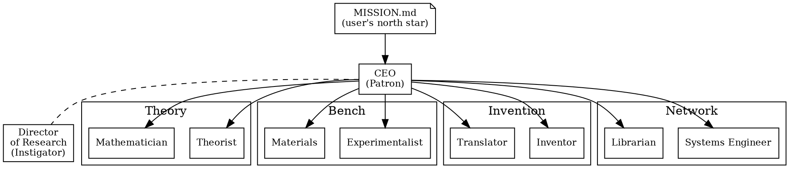

# Bell Labs Agent Company Implementation Plan

> **For agentic workers:** REQUIRED SUB-SKILL: Use superpowers:subagent-driven-development (recommended) or superpowers:executing-plans to implement this plan task-by-task. Steps use checkbox (`- [ ]`) syntax for tracking.

**Goal:** Build the `bell-labs/` company directory in `stubbi/companies` — a 10-agent industrial-research lab packaged in the Agent Companies v1 format, installable via `npx companies.sh add stubbi/companies/bell-labs`.

**Architecture:** Mirrors `academic-research/` and `financial-services/` layout (`manifest.yaml` as canonical source; `scripts/build.py` generates `COMPANY.md`, `teams/*/TEAM.md`, `agents/*/AGENTS.md`; hand-authored SKILL.md files for port-original skills). The differences vs. existing companies: (a) no `upstream:` block — this is an original synthesis, so `build.py`/`check.py` need to handle the no-upstream case, and (b) seven runtime directories (`hallway/`, `colloquium/`, `memoranda/`, `handoff/`, `problem-board/`, `instigation/`, `sunsets/`) each ship with a README explaining their role and are populated by the lab as it runs.

**Tech stack:** Python 3.11+, PyYAML, pytest. Markdown for all generated and hand-authored artifacts. SVG for org chart.

**Spec:** [`docs/superpowers/specs/2026-05-14-bell-labs-company-design.md`](../specs/2026-05-14-bell-labs-company-design.md). Re-read it before starting each task; the spec is the source of truth for skill semantics, the Hallway architecture, two-track operation, and the enforcement invariants.

**Branch:** `bell-labs` (already created off `main`).

---

## File Structure

This is what the finished `bell-labs/` directory looks like. Tasks below build it up in order.

```
bell-labs/
├── COMPANY.md                # generated by scripts/build.py
├── manifest.yaml             # canonical source (Task 2)
├── pyproject.toml            # Task 1
├── Makefile                  # Task 1
├── LICENSE                   # MIT (Task 14)
├── NOTICE                    # name-homage note (Task 14)
├── README.md                 # company README (Task 14)
├── scripts/                  # build + check, adapted from academic-research (Task 3)
│   ├── __init__.py
│   ├── build.py
│   └── check.py
├── tests/                    # adapted from academic-research (Task 3)
│   ├── fixtures/
│   │   └── manifest_minimal.yaml
│   ├── test_build.py
│   └── test_check.py
├── teams/                    # generated (Task 12)
│   ├── theory/TEAM.md
│   ├── bench/TEAM.md
│   ├── invention/TEAM.md
│   └── network/TEAM.md
├── agents/                   # generated (Task 12)
│   ├── ceo/AGENTS.md
│   ├── director/AGENTS.md
│   ├── theorist/AGENTS.md
│   ├── mathematician/AGENTS.md
│   ├── experimentalist/AGENTS.md
│   ├── materials/AGENTS.md
│   ├── inventor/AGENTS.md
│   ├── translator/AGENTS.md
│   ├── systems-engineer/AGENTS.md
│   └── librarian/AGENTS.md
├── skills/                   # 22 hand-authored SKILL.md (Tasks 4–10)
│   ├── onboarding-mission-interview/SKILL.md
│   ├── intake-triage/SKILL.md
│   ├── patron-budget/SKILL.md
│   ├── escalation-routing/SKILL.md
│   ├── monthly-summary/SKILL.md
│   ├── hallway-walk/SKILL.md
│   ├── instigation-question/SKILL.md
│   ├── continuation-review/SKILL.md
│   ├── project-sunset/SKILL.md
│   ├── technical-memorandum/SKILL.md
│   ├── hallway-traversal/SKILL.md
│   ├── two-track-operation/SKILL.md
│   ├── colloquium-participation/SKILL.md
│   ├── abstraction-build/SKILL.md
│   ├── math-consultancy/SKILL.md
│   ├── experiment-design/SKILL.md
│   ├── empirical-probe/SKILL.md
│   ├── invention-disclosure/SKILL.md
│   ├── handoff-document/SKILL.md
│   ├── problem-broker/SKILL.md
│   ├── library-push/SKILL.md
│   └── colloquium-curation/SKILL.md
├── hallway/README.md         # runtime dir (Task 13)
├── colloquium/README.md
├── memoranda/README.md
├── handoff/README.md
├── problem-board/README.md
├── instigation/README.md
├── sunsets/README.md
└── images/
    └── org-chart.png         # Task 15
```

Plus one change at the repo root:

- `README.md` — bump the Companies badge from `2` → `3` and add a Bell Labs catalog entry (Task 17).

---

## Conventions used across tasks

**Frontmatter for every port-original SKILL.md** (this is the exact form `academic-research/` uses; copy it):

```yaml
---
slug: <skill-slug>
name: <Skill Name>
description: <one-line description, matches manifest.yaml entry>
version: 0.1.0
metadata:
  sources:
    - mode: port-original
      author: Jannes Stubbemann
      added_in: 0.1.0
---
```

**SKILL.md body sections** (in this order, hand-authored):
1. Title (`# <Skill Name>`)
2. Port-original banner — one blockquote: `> **Port-original skill.** Hand-authored for this Agent Company; not from upstream. Owned by the <Role> role.`
3. `## When to fire` — the workflow trigger.
4. `## Inputs` — concrete inputs (files, queue state, user input).
5. `## Outputs` — the artifact produced; if it's a file, give the path template.
6. `## Procedure` — numbered steps the agent executes.
7. `## Invariants` *(when policy-enforced)* — the rules `make check` validates.
8. `## Anti-patterns` — what *not* to do; copy concrete language from the spec.

**Commit cadence:** one commit per task. Use a `bell-labs:` prefix for every commit message on this branch.

**Spec re-reads:** before each skill task, re-read the relevant spec section. Spec sections are listed in each task.

---

## Task 1: Repo scaffolding (Makefile, pyproject, tests scaffold)

**Files:**
- Create: `bell-labs/Makefile`
- Create: `bell-labs/pyproject.toml`
- Create: `bell-labs/scripts/__init__.py` (empty)
- Create: `bell-labs/tests/__init__.py` (empty)
- Create: `bell-labs/tests/fixtures/manifest_minimal.yaml`

- [ ] **Step 1.1: Create the directory skeleton**

```bash
mkdir -p bell-labs/scripts bell-labs/tests/fixtures bell-labs/skills bell-labs/images
```

- [ ] **Step 1.2: Write `bell-labs/Makefile`**

Copy from `academic-research/Makefile` but drop the `bump` target (we have no upstream to bump) and rewrite `clean` for the bell-labs file set:

```makefile
.PHONY: build check test clean

build:
	python -m scripts.build

check:
	python -m scripts.check

test:
	pytest -v

clean:
	rm -rf COMPANY.md teams/ agents/ images/org-chart.png
```

- [ ] **Step 1.3: Write `bell-labs/pyproject.toml`**

```toml
[project]
name = "bell-labs"
version = "0.1.0"
requires-python = ">=3.11"
dependencies = ["pyyaml>=6.0"]

[project.optional-dependencies]
dev = ["pytest>=7.0"]

[tool.setuptools.packages.find]
include = ["scripts*"]

[tool.pytest.ini_options]
pythonpath = ["."]
```

- [ ] **Step 1.4: Write empty `__init__.py` files**

```bash
touch bell-labs/scripts/__init__.py bell-labs/tests/__init__.py
```

- [ ] **Step 1.5: Write the minimal manifest fixture for tests**

`bell-labs/tests/fixtures/manifest_minimal.yaml`:

```yaml
schema: agentcompanies/v1
slug: test-co
name: Test Co
description: minimal fixture for testing
version: 0.1.0
license: MIT
authors:
  - name: Jannes Stubbemann
    email: jannes@paperclip.inc
goals: [test]
tags: [test]

teams:
  team-a:
    name: Team A
    description: a team

agents:
  alpha:
    name: Alpha
    title: Coordinator
    description: lone top-level coordinator
    skills: [skill-port]
  beta:
    name: Beta
    title: Worker
    team: team-a
    description: team-a worker
    skills: [skill-port]

skills:
  skill-port:
    name: Port Skill
    description: a hand-authored skill
    port_original: true
```

Note: no `upstream:` field. This is the shape the bell-labs build/check must accept.

- [ ] **Step 1.6: Verify the venv install works**

```bash
cd bell-labs && python3 -m venv .venv && . .venv/bin/activate && pip install -e ".[dev]"
```

Expected: install completes, `pytest --version` runs cleanly. (Don't commit `.venv/` — it should be ignored by repo-root `.gitignore`; verify with `git status` afterwards.)

- [ ] **Step 1.7: Commit**

```bash
git add bell-labs/Makefile bell-labs/pyproject.toml bell-labs/scripts/__init__.py \
        bell-labs/tests/__init__.py bell-labs/tests/fixtures/manifest_minimal.yaml
git commit -m "bell-labs: repo scaffolding (Makefile, pyproject, tests skeleton)"
```

---

## Task 2: manifest.yaml (canonical source)

**Files:**
- Create: `bell-labs/manifest.yaml`

This is the canonical source the build script reads. It must list every team, agent, and skill the spec defines (§§4.1–4.5 + 5). Skill set, agent set, and team set must match the spec exactly — any drift here cascades through generated artifacts and validation.

- [ ] **Step 2.1: Re-read spec §§2 (identity), 4 (teams and agents), 5 (skills).**

- [ ] **Step 2.2: Write `bell-labs/manifest.yaml`**

```yaml
schema: agentcompanies/v1
slug: bell-labs
name: Bell Labs
description: >
  10-agent industrial-research lab modeled on Bell Labs (1925–1984). CEO is a
  Kelly-style patron and a separate Director of Research is the Pierce-style
  instigator. Researchers cover the five Bell Labs archetypes — theorist,
  experimentalist, inventor, translator, and wise head — plus a systems
  engineer who brokers problems from the user's real "network" and a
  librarian who runs the colloquium and pushes prior memos into active
  threads. Two-track operation: every researcher runs a CEO-directed queue
  and a self-owned curiosity queue; the curiosity queue is protected by
  policy. Output is the Technical Memorandum.
version: 0.1.0
license: MIT
authors:
  - name: Jannes Stubbemann
    email: jannes@paperclip.inc
goals:
  - Carry out long-horizon (months to years) research arcs in service of the user's declared north-star mission, staging every output as a dated, witnessed Technical Memorandum for human review.
  - Preserve Bell Labs' five-archetype structure with a separated patron (CEO) and instigator (Director of Research), plus the systems-engineer and librarian boundary roles every modern imitator has dropped.
  - Encode forced cross-archetype traversal — the Hallway, the weekly Colloquium, and Director's walks — as policy, not vibe. Each researcher's workflow blocks on reading other teams' recent work before planning.
tags: [research, invention, industrial-research, bell-labs, technical-memo, directed-curiosity, long-horizon]

affiliation: "Name homage. Not affiliated with or endorsed by Nokia / Nokia Bell Labs."

teams:
  theory:
    name: Theory
    description: Builds the abstraction — invariants, reductions, mathematical objects — and runs the 25%-time math consultancy that any other team can pull in.
  bench:
    name: Bench
    description: Designs and runs experiments (code, simulation, ablation, controlled tests); surveys datasets, libraries, prior art, and instruments to characterize the "material" being worked on.
  invention:
    name: Invention
    description: Embodies working principles in devices, algorithms, and artifacts; runs the 3-stage Western-Electric-style productization that turns matured memoranda into user-deliverable handoffs.
  network:
    name: Network
    description: Boundary team. The Systems Engineer brokers problems from the user's real-world "network"; the Librarian pushes prior memoranda into active threads and runs the weekly Colloquium.

agents:
  ceo:
    name: CEO
    title: Chief Executive Officer (Patron)
    description: |
      Mervin Kelly archetype. Conducts the onboarding mission interview, writes
      and protects MISSION.md, manages intake routing, defends iteration
      budgets against ship-pressure, and produces a monthly state-of-the-lab
      summary for the user. Does not instigate research questions — Kelly
      explicitly did not. Patron, not boss.
    skills: [onboarding-mission-interview, intake-triage, patron-budget, escalation-routing, monthly-summary]
  director:
    name: Director of Research
    title: Director of Research (Instigator)
    description: |
      John Pierce archetype. The lab's taste organ. Reads the Hallway daily,
      runs the weekly continuation review with the CEO, posts instigation
      questions (rate-limited to ≤1 per researcher per cycle), and signs every
      project sunset. The only agent allowed to inject into a researcher's
      directed queue mid-stream — and even that arrives as a question.
    skills: [hallway-walk, instigation-question, continuation-review, project-sunset]
  theorist:
    name: Theorist
    title: Theorist
    team: theory
    description: |
      Shannon archetype. Builds the abstraction: finds the right invariant, the
      right reduction, the right mathematical object. Writes the long, BSTJ-shaped
      TMs that name a thing for the first time.
    skills: [abstraction-build, technical-memorandum, hallway-traversal, two-track-operation, colloquium-participation]
  mathematician:
    name: Mathematician
    title: Mathematician (25%-time consultant)
    team: theory
    description: |
      Tukey / Fry archetype. 25%-of-cycles internal consultant. Any other team
      can pull the Mathematician in by filing a consult-request; the
      Mathematician must accept unless their own queue is blocked. Owns rigor
      flow across the lab.
    skills: [math-consultancy, technical-memorandum, hallway-traversal, two-track-operation, colloquium-participation]
  experimentalist:
    name: Experimentalist
    title: Experimentalist
    team: bench
    description: |
      Brattain archetype. Designs and runs the experiment that disconfirms or
      confirms — code experiments, simulations, ablations, controlled tests.
      Pre-registers the prediction in a Hallway entry before running.
    skills: [experiment-design, technical-memorandum, hallway-traversal, two-track-operation, colloquium-participation]
  materials:
    name: Materials
    title: Materials / Empiricist
    team: bench
    description: |
      Pearson / Teal archetype. Surveys what's already out there — datasets,
      libraries, prior art, instruments — and probes specific empirical
      questions to characterize the "material" being worked on.
    skills: [empirical-probe, technical-memorandum, hallway-traversal, two-track-operation, colloquium-participation]
  inventor:
    name: Inventor
    title: Inventor
    team: invention
    description: |
      Bardeen / Hamming archetype. Sees a working principle and embodies it in
      a device, algorithm, or artifact. Writes the invention disclosure paired
      with a TM.
    skills: [invention-disclosure, technical-memorandum, hallway-traversal, two-track-operation, colloquium-participation]
  translator:
    name: Translator
    title: Translator (Western Electric liaison)
    team: invention
    description: |
      The load-bearing role every modern imitator drops. Takes a matured TM
      and runs the 3-stage productization: (1) lab-model spec, (2)
      pre-production design with interfaces and tolerances, (3) user-ready
      handoff with test fixtures, runbook, and rollback. Owns the boundary
      between research and user-deliverable.
    skills: [handoff-document, technical-memorandum, hallway-traversal, two-track-operation, colloquium-participation]
  systems-engineer:
    name: Systems Engineer
    title: Systems Engineer (problem broker)
    team: network
    description: |
      Watches the user's real-world "network" (whatever MISSION.md named) and
      surfaces friction back to the lab as candidate problems on the
      problem-board. Problems are proposed, not assigned. The Director picks
      them up during hallway-walk.
    skills: [problem-broker, technical-memorandum, hallway-traversal, two-track-operation, colloquium-participation]
  librarian:
    name: Librarian
    title: Librarian (active routing)
    team: network
    description: |
      Not a storage bin: a push service. Reads every new TM and Hallway
      entry, pushes relevant prior work to active threads, runs the weekly
      Colloquium, curates the "what's hot" digest, prunes Hallway entries
      that read like logs.
    skills: [library-push, colloquium-curation, technical-memorandum, hallway-traversal, two-track-operation, colloquium-participation]

skills:
  # CEO-owned (5)
  onboarding-mission-interview:
    name: Onboarding Mission Interview
    description: First-run wizard that turns the user's intent into MISSION.md (north-star, 1y/5y arcs, sunset conditions). Refuses to finish until the mission has a real fence.
    port_original: true
  intake-triage:
    name: Intake Triage
    description: Classify a new user request as on-mission, off-mission, or curiosity-seed; route to a team's directed queue or surface to the Director.
    port_original: true
  patron-budget:
    name: Patron Budget
    description: Name the iteration budget for each active thread and resist ship-pressure; produce a budget-defense memo when challenged.
    port_original: true
  escalation-routing:
    name: Escalation Routing
    description: Package context and route real blockers to the user; explicitly not "ask the Director to override the curiosity queue."
    port_original: true
  monthly-summary:
    name: Monthly Summary
    description: Kelly-style state-of-the-lab note to the user — shipped, mid-arc, sunset, heating curiosity threads. No Gantt.
    port_original: true

  # Director-of-Research-owned (4)
  hallway-walk:
    name: Hallway Walk
    description: Daily — read the last 24h of Hallway entries, identify cross-team adjacencies that warrant a Pierce-style instigation.
    port_original: true
  instigation-question:
    name: Instigation Question
    description: One-paragraph reframing question routed to a specific researcher. Rate-limited to ≤1 per researcher per cycle. Tap-on-the-shoulder, not assignment.
    port_original: true
  continuation-review:
    name: Continuation Review
    description: Weekly review with the CEO — which threads continue, which need a math consult, which are candidates for the Translator, which are at risk. Read-only on curiosity threads.
    port_original: true
  project-sunset:
    name: Project Sunset
    description: Write the sunset memo — what we learned, where the people redeploy, why this isn't a failure. The artifact is the anti-firing signal.
    port_original: true

  # Shared researcher core (4) — referenced by all 8 researchers
  technical-memorandum:
    name: Technical Memorandum
    description: Canonical output. Dated, signed, witness-countersigned by a peer agent. Abstract → problem → prior TMs → method → result → open questions. ≤10 pages.
    port_original: true
  hallway-traversal:
    name: Hallway Traversal
    description: Workflow precondition. Before every planning step, read the last N Hallway entries from other teams, note influences (including "none did"), then post one's own short Hallway entry. Blocking.
    port_original: true
  two-track-operation:
    name: Two-Track Operation
    description: Maintain a Directed queue (CEO/team-assigned) and a Curiosity queue (self-seeded). Default 60% directed / 40% curiosity. Director never overrides Curiosity.
    port_original: true
  colloquium-participation:
    name: Colloquium Participation
    description: Write the weekly 5-minute briefing into colloquium/YYYY-WW.md and read everyone else's before the next planning cycle.
    port_original: true

  # Theory team specialized
  abstraction-build:
    name: Abstraction Build
    description: Given a messy phenomenon or stuck experiment, propose the right invariant, reduction, or mathematical object. Outputs a Theory TM.
    port_original: true
  math-consultancy:
    name: Math Consultancy
    description: 25%-time pull-mode skill. Any team can request a math consult via consult-request/; the Mathematician must accept unless their own queue is blocked. Output is a witnessed addendum TM attributed to both teams.
    port_original: true

  # Bench team specialized
  experiment-design:
    name: Experiment Design
    description: Turn a question into a falsifiable experiment (code, simulation, ablation, controlled test). Pre-register the prediction in a Hallway entry before running; result becomes a TM regardless of outcome.
    port_original: true
  empirical-probe:
    name: Empirical Probe
    description: Survey what's already out there (datasets, libraries, prior art, instruments) and probe specific empirical questions to characterize the "material" being worked on. Output is the materials TM plus a curated source list pushed to the Librarian.
    port_original: true

  # Invention team specialized
  invention-disclosure:
    name: Invention Disclosure
    description: Patent-disclosure-shaped artifact paired with a TM — conception date, witness sign-off, prior-art delta, claims sketch, reproducibility statement. The lab does not file patents; the form forces concreteness.
    port_original: true
  handoff-document:
    name: Handoff Document
    description: Three-stage productization enforced as one skill with three required stages — (1) lab-model spec, (2) pre-production design with interfaces and tolerances, (3) user-ready handoff with test fixtures, runbook, rollback. Cannot ship stage 3 without stages 1 and 2 on file.
    port_original: true

  # Network team specialized
  problem-broker:
    name: Problem Broker
    description: Watch the user's real-world "network"; surface friction as candidate problems on the problem-board. Proposed, not assigned. The Director picks up the board during hallway-walk.
    port_original: true
  library-push:
    name: Library Push
    description: On every new TM or Hallway entry, search prior memoranda for relevance and push the top-K to the relevant researcher's queue as a citation suggestion. Not search; push.
    port_original: true
  colloquium-curation:
    name: Colloquium Curation
    description: Schedule the weekly Colloquium, produce the "what's hot this week" digest the Director reviews, prune Hallway entries that read like logs (with a one-line note to the offender).
    port_original: true
```

- [ ] **Step 2.3: Verify the manifest parses as YAML**

```bash
python3 -c "import yaml; yaml.safe_load(open('bell-labs/manifest.yaml'))" && echo OK
```

Expected: `OK`. Any YAML error means fix it before continuing.

- [ ] **Step 2.4: Verify counts (sanity)**

```bash
python3 -c "
import yaml
m = yaml.safe_load(open('bell-labs/manifest.yaml'))
print('teams', len(m['teams']))
print('agents', len(m['agents']))
print('skills', len(m['skills']))
"
```

Expected:
```
teams 4
agents 10
skills 22
```

If any of those is off, the spec drifted — re-read spec §4 and §5 and fix the manifest.

- [ ] **Step 2.5: Commit**

```bash
git add bell-labs/manifest.yaml
git commit -m "bell-labs: canonical manifest (4 teams, 10 agents, 22 port-original skills)"
```

---

## Task 3: Adapt `build.py` and `check.py` for no-upstream

The existing `academic-research/scripts/build.py` assumes every manifest has an `upstream:` block (a hard `m.upstream.commit` access). Bell Labs has none. We adapt the two scripts to handle the no-upstream case, then port them in.

**Files:**
- Create: `bell-labs/scripts/build.py` (adapted from `academic-research/scripts/build.py`)
- Create: `bell-labs/scripts/check.py` (adapted from `academic-research/scripts/check.py`)
- Create: `bell-labs/tests/test_build.py` (adapted)
- Create: `bell-labs/tests/test_check.py` (adapted)

- [ ] **Step 3.1: Copy the existing scripts as a starting point**

```bash
cp academic-research/scripts/build.py bell-labs/scripts/build.py
cp academic-research/scripts/check.py bell-labs/scripts/check.py
cp academic-research/tests/test_build.py bell-labs/tests/test_build.py
cp academic-research/tests/test_check.py bell-labs/tests/test_check.py
```

- [ ] **Step 3.2: Write the failing test for no-upstream load**

Append to `bell-labs/tests/test_build.py`:

```python
def test_load_manifest_accepts_no_upstream():
    """Bell Labs is original synthesis — manifest has no `upstream:` block."""
    fixture = Path(__file__).parent / "fixtures" / "manifest_minimal.yaml"
    m = load_manifest(fixture)
    assert m.upstream is None  # not raised, just absent
    assert m.affiliation is None or isinstance(m.affiliation, str)
```

- [ ] **Step 3.3: Run the test to confirm it fails**

```bash
cd bell-labs && pytest tests/test_build.py::test_load_manifest_accepts_no_upstream -v
```

Expected: FAIL with a `KeyError: 'upstream'` from `load_manifest`.

- [ ] **Step 3.4: Make `upstream` optional in `bell-labs/scripts/build.py`**

In `load_manifest`, change the `upstream` extraction from a required `raw["upstream"]` to an optional one. Find the block that constructs the `Manifest` (search for `upstream=Upstream(`) and replace with:

```python
    upstream_raw = raw.get("upstream")
    upstream = (
        Upstream(
            repo=upstream_raw["repo"],
            commit=upstream_raw["commit"],
            license=upstream_raw["license"],
        )
        if upstream_raw is not None
        else None
    )
```

Then in the `Manifest` dataclass, change the type annotation of the `upstream` field from `Upstream` to `Upstream | None`. Also change `usage_restriction: str` to `usage_restriction: str | None = None` (bell-labs has none).

The `affiliation` field is already optional in the academic-research script — verify; if not, also make it `str | None`.

- [ ] **Step 3.5: Update every site that reads `m.upstream` to handle `None`**

Search for `m.upstream` and `manifest.upstream` in `build.py`:

```bash
grep -n "\.upstream" bell-labs/scripts/build.py
```

For each call site that assumes an upstream (e.g. fetching skill files via `fetch_upstream_file(m.upstream.repo, m.upstream.commit, …)`):
- If the surrounding code is fetching upstream skill content for a `referenced` skill, gate the entire block on `if m.upstream is not None and skill.upstream_path is not None`. For Bell Labs every skill has `port_original=True`, so the upstream branch is never taken.
- If the surrounding code is emitting `metadata.upstream` into a generated frontmatter, gate emission on `if m.upstream is not None`.

- [ ] **Step 3.6: Run the test, verify it passes**

```bash
cd bell-labs && pytest tests/test_build.py::test_load_manifest_accepts_no_upstream -v
```

Expected: PASS.

- [ ] **Step 3.7: Make `check.py` handle no-upstream**

The function `check_content_hashes` already iterates over skills and only fetches upstream content for `mode: referenced` sources — port-original skills are skipped. Verify by reading the function. The risk is that it imports `fetch_upstream_file` at module load; if `fetch_upstream_file` is now defensive about missing upstream, no change is needed. Otherwise: wrap the fetch in `try/except` or gate on manifest-level upstream presence.

For the bell-labs case where the manifest has no `upstream:`, no referenced-mode skill exists, so `check_content_hashes` will be a no-op. Add a regression test:

Append to `bell-labs/tests/test_check.py`:

```python
def test_check_content_hashes_noop_when_no_referenced_skills(tmp_path):
    """No referenced skills = no upstream fetch needed."""
    from scripts.check import check_content_hashes
    # An empty skills dir contains no SKILL.md files, so check_content_hashes is a no-op.
    (tmp_path / "skills").mkdir()
    check_content_hashes(tmp_path)  # must not raise
```

- [ ] **Step 3.8: Run the full test suite**

```bash
cd bell-labs && pytest -v
```

Expected: every test passes (both ported tests and the two new no-upstream tests). If a ported academic-research test fails because it asserted `upstream.commit == "deadbeef"` and the bell-labs minimal fixture has no upstream, *update the ported test* to reflect the new fixture — bell-labs's fixture is the source of truth for bell-labs tests.

- [ ] **Step 3.9: Commit**

```bash
git add bell-labs/scripts/build.py bell-labs/scripts/check.py \
        bell-labs/tests/test_build.py bell-labs/tests/test_check.py
git commit -m "bell-labs: adapt build/check for no-upstream (original synthesis)"
```

---

## Tasks 4–10: hand-author the 22 SKILL.md files

Seven batches grouped by ownership/team. Each task ends in a commit. Re-read the spec section listed before starting.

Every SKILL.md follows the template at the top of this plan (frontmatter + 8-section body). The body is hand-authored prose; the spec is the source of truth for semantics. The author should:

- Quote the spec's policy invariants verbatim where they exist (the spec is precise about things like "rate-limited ≤1 per researcher per cycle" — the SKILL.md must reproduce that exactly).
- Use concrete file paths (`hallway/2026-05-14-theorist-surface-states.md`, `memoranda/TM-0042.md`) in the Outputs section.
- Keep each SKILL.md to ≤300 lines.

After each batch, run `make check` from inside `bell-labs/` to validate frontmatter shape and cross-references.

### Task 4: CEO-owned skills (5)

**Spec section to re-read:** §§4.1, 5 (CEO-owned), 6.5 (escalation policy).

**Files:**
- Create: `bell-labs/skills/onboarding-mission-interview/SKILL.md`
- Create: `bell-labs/skills/intake-triage/SKILL.md`
- Create: `bell-labs/skills/patron-budget/SKILL.md`
- Create: `bell-labs/skills/escalation-routing/SKILL.md`
- Create: `bell-labs/skills/monthly-summary/SKILL.md`

- [ ] **Step 4.1: Write `onboarding-mission-interview/SKILL.md`**

Frontmatter (mechanical):

```yaml
---
slug: onboarding-mission-interview
name: Onboarding Mission Interview
description: First-run wizard that turns the user's intent into MISSION.md (north-star, 1y/5y arcs, sunset conditions). Refuses to finish until the mission has a real fence.
version: 0.1.0
metadata:
  sources:
    - mode: port-original
      author: Jannes Stubbemann
      added_in: 0.1.0
---
```

Body content brief (hand-authored prose; expand each section into ≥1 paragraph):

- **Title:** `# Onboarding Mission Interview`.
- **Banner:** `> **Port-original skill.** Hand-authored for this Agent Company; not from upstream. Owned by the CEO role.`
- **When to fire:** First action after the user installs the company. Blocks all other lab activity until `MISSION.md` exists at the company root.
- **Inputs:** None initially — the CEO drives the conversation. Optional: a user-supplied seed document.
- **Outputs:** `MISSION.md` at the company root with exactly these sections — North-star problem; 1-year arc; 5-year arc; What counts as "improving the network"; Sunset conditions; Anything to flag to the user immediately.
- **Procedure:** Numbered. (1) Greet, explain why a mission is required (the lab is directed-curiosity, not chat). (2) Ask for the north-star problem in the user's own words; refuse vague answers ("AI" is not a mission, "improve our customer-support routing" is). (3) Capture 1y/5y arcs as separate paragraphs. (4) Define "improving the network": what observable would show progress? (5) Define sunset conditions: what would force the user to stop the lab? (6) Show the draft `MISSION.md`; let the user edit. (7) Commit `MISSION.md`; mark `make check` ready to proceed.
- **Invariants:** Refuses to write `MISSION.md` if any of the six sections is empty or visibly hand-waved. The phrasing of the refusal is part of the skill: explain that without a fence the lab is just chat.
- **Anti-patterns:** "Generate a generic SaaS company mission." "Accept 'do good research' as a mission." "Add a deadline field — Bell Labs explicitly did not have one."

- [ ] **Step 4.2: Write `intake-triage/SKILL.md`** — see spec §5 (CEO-owned bullet 2). Sections: When to fire (any incoming user message that isn't pure status); Inputs (the message + current `MISSION.md`); Outputs (a triage decision recorded as a Hallway entry, plus routing); Procedure (classify on-mission / off-mission / curiosity-seed → route to a team's Directed queue or surface to Director as a candidate instigation); Invariants (off-mission requests get a reply asking the user whether to update `MISSION.md` or defer the request); Anti-patterns ("silently update `MISSION.md`"; "route to a researcher's Curiosity queue").

- [ ] **Step 4.3: Write `patron-budget/SKILL.md`** — spec §5 (CEO-owned bullet 3) + §3 (forced-traversal) + §6.3 (monthly loop) + §9 (translation matrix row "5–25 year horizons"). Sections: When to fire (monthly; or on any user ship-pressure request); Inputs (active-thread list with their last-named budget); Outputs (`memoranda/budget/YYYY-MM.md` naming the budget for each thread, plus the budget-defense memo when challenged); Procedure (review each thread's progress vs. its current budget; extend, hold, or initiate a sunset conversation with the Director; when the user asks "why isn't X done yet?" reply with the named budget and a one-paragraph defense); Invariants (every active thread has a named budget at all times; budget cuts trigger Director continuation review, not a unilateral sunset).

- [ ] **Step 4.4: Write `escalation-routing/SKILL.md`** — spec §6.5. Sections: When to fire (a researcher posts a real blocker that needs a real-world action); Inputs (the blocker + the context the researcher attached); Outputs (a user-facing message + a Hallway entry recording the escalation); Procedure (verify it's a real blocker, not "I want to be redirected"; package context; send to user; do not modify the researcher's Curiosity queue under any condition); Invariants (the Director cannot trigger an escalation — only researchers and the CEO); Anti-patterns ("auto-redirect to a different researcher"; "escalate hallway-pruning disputes to the user").

- [ ] **Step 4.5: Write `monthly-summary/SKILL.md`** — spec §6.3. Sections: When to fire (calendar — first of each month); Outputs (`memoranda/monthly/YYYY-MM-summary.md` plus a copy delivered to the user); Procedure (narrative, not Gantt — what shipped, what is mid-arc, what was sunset, which curiosity threads are heating up; include 1-2 specific TM citations; close with the next month's named iteration budgets); Anti-patterns ("Gantt chart"; "RAG status"; "executive summary that hides what was sunset").

- [ ] **Step 4.6: Validate frontmatter and run check**

```bash
cd bell-labs && python3 -c "
from scripts.check import parse_frontmatter, validate_frontmatter
from pathlib import Path
for p in Path('skills').glob('*/SKILL.md'):
    fm = parse_frontmatter(p.read_text())
    validate_frontmatter('skill', fm)
    print(p, 'OK')
"
```

Expected: each of the 5 SKILL.md prints `OK`. Any failure means the frontmatter is malformed — fix and re-run.

- [ ] **Step 4.7: Commit**

```bash
git add bell-labs/skills/onboarding-mission-interview \
        bell-labs/skills/intake-triage \
        bell-labs/skills/patron-budget \
        bell-labs/skills/escalation-routing \
        bell-labs/skills/monthly-summary
git commit -m "bell-labs: CEO-owned skills (5)"
```

### Task 5: Director-of-Research-owned skills (4)

**Spec section to re-read:** §§3.4, 4.1 (Director), 5 (Director-owned), 7 (anti-cargo-cult).

**Files:**
- Create: `bell-labs/skills/hallway-walk/SKILL.md`
- Create: `bell-labs/skills/instigation-question/SKILL.md`
- Create: `bell-labs/skills/continuation-review/SKILL.md`
- Create: `bell-labs/skills/project-sunset/SKILL.md`

- [ ] **Step 5.1: `hallway-walk/SKILL.md`** — frontmatter per template; banner names the Director as owner. Body sections: When to fire (daily, first action of the Director's cycle); Inputs (last 24h of `hallway/*.md`); Outputs (a hallway-walk note `hallway/YYYY-MM-DD-director-walk.md` summarizing cross-team adjacencies); Procedure (read all entries; group by team; identify adjacencies — Theorist's abstraction maps to Experimentalist's anomaly, Materials' source list contains a primary citation the Inventor missed; mark candidates for `instigation-question`); Invariants (read every entry; do not filter by team before reading); Anti-patterns ("only read the Theorist's entries"; "summarize without naming specific cross-team links").

- [ ] **Step 5.2: `instigation-question/SKILL.md`** — body sections: When to fire (only after `hallway-walk` produced a candidate); Inputs (the candidate adjacency); Outputs (`instigation/YYYY-MM-DD-<researcher>-<slug>.md` — a one-paragraph reframing question routed to a specific researcher); Procedure (write the question as a *question*, not a directive; the receiving agent must respond but is free to reject; route to *one* researcher only); Invariants (rate limit: ≤1 instigation per researcher per cycle, enforced; cannot inject into a researcher's Curiosity queue — the instigation appears in the receiving researcher's Directed queue with explicit "you may decline" framing); Anti-patterns ("write as imperative"; "broadcast to a team"; "follow up if declined").

- [ ] **Step 5.3: `continuation-review/SKILL.md`** — body sections: When to fire (weekly with the CEO); Inputs (the active-thread list from `patron-budget`); Outputs (`memoranda/continuation/YYYY-WW.md` with per-thread continue / pivot / handoff-to-Translator / sunset recommendations); Procedure (Director walks the Directed threads; CEO names budget implications; the *Curiosity* threads are not named in this artifact — they are read-only at this layer); Invariants (no Curiosity thread appears by name; sunset recommendations only — the `project-sunset` skill produces the actual sunset memo).

- [ ] **Step 5.4: `project-sunset/SKILL.md`** — body sections: When to fire (continuation-review recommended a sunset, or the budget was repeatedly exhausted, or the researcher requested it); Outputs (`sunsets/YYYY-MM-DD-<thread-slug>.md`); Procedure (write the memo: what we learned, where the people redeploy, why this isn't a failure; cite at least one TM); Invariants (the sunset memo is the anti-firing signal — its presence is what makes shutting a thread down safe; cannot sunset without redeploying the agent-cycles to another named thread).

- [ ] **Step 5.5: Validate and commit**

```bash
cd bell-labs && python3 -c "
from scripts.check import parse_frontmatter, validate_frontmatter
from pathlib import Path
for slug in ['hallway-walk','instigation-question','continuation-review','project-sunset']:
    fm = parse_frontmatter(Path(f'skills/{slug}/SKILL.md').read_text())
    validate_frontmatter('skill', fm)
    print(slug, 'OK')
"
git add bell-labs/skills/hallway-walk bell-labs/skills/instigation-question \
        bell-labs/skills/continuation-review bell-labs/skills/project-sunset
git commit -m "bell-labs: Director-of-Research-owned skills (4)"
```

### Task 6: Shared researcher core (4)

**Spec section to re-read:** §§3 (the Hallway), 5 (Shared researcher core), 6.1 (per-cycle loop), 6.4 (two-track mechanics), 7 (`make check` enforces).

This batch is the most policy-load-bearing in the company. These skills encode the Bell Labs operating discipline. They are referenced by all 8 researcher agents.

**Files:**
- Create: `bell-labs/skills/technical-memorandum/SKILL.md`
- Create: `bell-labs/skills/hallway-traversal/SKILL.md`
- Create: `bell-labs/skills/two-track-operation/SKILL.md`
- Create: `bell-labs/skills/colloquium-participation/SKILL.md`

- [ ] **Step 6.1: `technical-memorandum/SKILL.md`** — the canonical output skill.

Body sections:
- **When to fire:** any time a researcher produces a result worth recording. The default is *always* — the cost of writing a TM is lower than the cost of an orphan claim.
- **Inputs:** the result (data, code, conclusion, partial); prior TMs that motivated this work; the researcher's Hallway entries from the cycle.
- **Outputs:** `memoranda/TM-NNNN-<slug>.md` where `NNNN` is the next sequential 4-digit integer. The TM has these required sections — Title (with date and author), Witness (the peer-signature block — see Invariants), Abstract (≤200 words), Problem, Prior TMs cited (a list of `TM-NNNN` references; must be ≥1; can be a Hallway entry instead), Method, Result, Open questions.
- **Procedure:**
  1. Draft the TM with all sections populated.
  2. Choose a peer agent for the witness countersignature. Default: a researcher on a different team (a Theorist's witness is preferentially a Bench or Network researcher, not the Mathematician). The Director can override this default in their continuation review.
  3. Send the draft to the chosen peer. The peer reads, returns a structured critique with these required fields — *Claim under examination*, *What I would do differently*, *What I think is wrong*, *Sign or refuse-to-sign*. The peer may refuse to sign; the author iterates and re-submits.
  4. On sign, the witness block is filled in (peer name + date + the critique verbatim) and the TM is committed.
- **Invariants** (enforced by `make check`):
  - The witness block must be non-empty.
  - The Prior TMs section must cite ≥1 prior TM or Hallway entry. No orphan claims.
  - TM filename matches `TM-\d{4}-[a-z0-9-]+\.md`.
- **Anti-patterns:** "self-witness"; "refuse-to-sign loop > 3 attempts" (escalate to Director); "TM with empty Open questions" (every TM has open questions — that's the whole point of writing things down).

- [ ] **Step 6.2: `hallway-traversal/SKILL.md`** — the blocking workflow precondition.

Body sections:
- **When to fire:** before *every* planning step by *every* researcher. Blocking, not advisory. The agent's cycle cannot proceed without it.
- **Inputs:** the last N entries from `hallway/*.md` written by researchers on *other teams* (default N=10, configurable in `manifest.yaml` under `metadata.hallway_traversal_n`).
- **Outputs:** one short Hallway entry at `hallway/YYYY-MM-DD-<author>-<slug>.md` describing what the agent read, which entries influenced its next plan (including "none did" as a valid answer), and what it's about to do.
- **Procedure:**
  1. Read the last N other-team entries chronologically.
  2. For each, note (internally) whether it bears on the agent's current threads.
  3. Write the Hallway entry — short (≤200 words), human-readable, dated, attributed. Explicit "Influenced by:" line citing zero-to-many entries.
  4. Commit the Hallway entry before proceeding to plan.
- **Invariants:** The agent's next action *must* be preceded by a Hallway entry from the same date and author. Enforced by `make check`. The Hallway entry is committed *before* the planning, not after.
- **Anti-patterns:** "dump raw experiment logs into the Hallway" (the Librarian prunes; Hallway is corridor-talk, not logs); "skip traversal if no new entries from other teams" (still post your own — "no new cross-team entries; planning <X>"); "rationalize that the Hallway didn't apply" (the influence line can say "none did" — that's fine, but you must read).

- [ ] **Step 6.3: `two-track-operation/SKILL.md`** — the two-queue mechanic.

Body sections:
- **When to fire:** at the start of every planning cycle, immediately after `hallway-traversal`.
- **Inputs:** the agent's `agents/<role>/queue.md` (created on first use; template at the bottom of this skill).
- **Outputs:** one entry added to either `## Directed` or `## Curiosity`; the planned action selected and executed.
- **Procedure:**
  1. Read `agents/<role>/queue.md`.
  2. If `## Directed` has unfinished items, pick the next per their listed order — *unless* the 60/40 cycle balance is currently underweight on Curiosity (track a rolling 10-cycle counter), in which case pick a Curiosity item.
  3. If both queues are empty, seed the Curiosity queue from `MISSION.md` + the agent's archetype literature, then pick from Curiosity.
  4. Mark the chosen item with a date and proceed.
- **Invariants** (enforced by `make check`):
  - `agents/<role>/queue.md` has both `## Directed` and `## Curiosity` sections.
  - The git history shows *only the researcher agent* has written to the `## Curiosity` section. (Catch: a check that examines `git log -p` on the queue file and verifies every diff to the Curiosity section has the researcher's own author signature.)
  - The default cycle balance is 60% Directed / 40% Curiosity; configurable per researcher in `manifest.yaml` under `agents.<role>.metadata.curiosity_ratio` (a float in [0.0, 1.0]).
- **Anti-patterns:** "CEO writes to Curiosity to nudge a researcher" (forbidden); "Director writes to Curiosity in instigation-question" (forbidden; instigation goes to Directed); "promote Curiosity to Directed without an explicit researcher-signed addendum line."

- [ ] **Step 6.4: `colloquium-participation/SKILL.md`** — the weekly briefing.

Body sections:
- **When to fire:** Weekly, on Monday of each ISO week (configurable). Every researcher participates.
- **Inputs:** the agent's TMs and Hallway entries from the past week; the prior weeks' colloquium digests.
- **Outputs:** one section appended to `colloquium/YYYY-WW.md`. Sections: *Author*; *What I worked on*; *What I'm stuck on*; *What I'd love a second pair of eyes on*. ≤5 minutes' reading at normal pace.
- **Procedure:** (1) Write the section, (2) read everyone else's section in the same file before next planning cycle, (3) the Librarian curates the digest after all researchers have posted.
- **Invariants:** Every researcher has a section by the end of the colloquium day. Missing-researcher is a `make check` warning.
- **Anti-patterns:** "skip if nothing happened" — write *something*, even if it's "I read four prior TMs, nothing to report"; "summarize without naming what I'm stuck on" — the stuck part is the whole point.

- [ ] **Step 6.5: Validate and commit**

```bash
cd bell-labs && python3 -c "
from scripts.check import parse_frontmatter, validate_frontmatter
from pathlib import Path
for slug in ['technical-memorandum','hallway-traversal','two-track-operation','colloquium-participation']:
    fm = parse_frontmatter(Path(f'skills/{slug}/SKILL.md').read_text())
    validate_frontmatter('skill', fm)
    print(slug, 'OK')
"
git add bell-labs/skills/technical-memorandum bell-labs/skills/hallway-traversal \
        bell-labs/skills/two-track-operation bell-labs/skills/colloquium-participation
git commit -m "bell-labs: shared researcher core (4 skills) — TM + Hallway + two-track + colloquium"
```

### Task 7: Theory team specialized (2)

**Spec section to re-read:** §§4.2 (Theory), 5 (Theory team), 9 (Mathematical Research consultancy row).

**Files:**
- Create: `bell-labs/skills/abstraction-build/SKILL.md`
- Create: `bell-labs/skills/math-consultancy/SKILL.md`

- [ ] **Step 7.1: `abstraction-build/SKILL.md`** — owned by Theorist. Sections: When to fire (a stuck experiment, a messy phenomenon, or a Hallway entry from the Bench team that smells like an unnamed invariant); Inputs (the phenomenon + adjacent TMs); Outputs (a Theory TM proposing the invariant/reduction/object); Procedure (find candidate abstractions; for each, state what it would predict; pick the one that predicts more than it was designed for; write the TM citing the original phenomenon); Anti-patterns ("propose an abstraction with no testable consequence"; "skip the original phenomenon citation").

- [ ] **Step 7.2: `math-consultancy/SKILL.md`** — owned by Mathematician.

Body sections:
- **When to fire:** A request appears under `consult-request/YYYY-MM-DD-<requestor>-<slug>.md`. The Mathematician must accept the consult unless their own Directed queue is currently blocked (in which case they file a `consult-deferred/` note and the Director picks it up at the next continuation review).
- **Inputs:** the consult request + the requestor's TM that prompted it.
- **Outputs:** an addendum TM `memoranda/TM-NNNN-consult-<slug>.md` co-authored by the requestor and the Mathematician (both names in the Witness block).
- **Procedure:** (1) Read the request and the cited TM, (2) name the mathematical structure that fits the problem (or note explicitly that no clean structure exists yet), (3) write the addendum TM with the *requestor's TM as Prior TM*.
- **Invariants:** The Mathematician spends at most 25% of cycles on consults (rolling-cycle window). If consult demand exceeds that, the Mathematician escalates to the Director.
- **Anti-patterns:** "decline a consult because the question is poorly framed" (instead, write a one-section addendum naming what would have to be true to answer it); "absorb the requestor's work into your own queue" (the consult is a *visit*, not a transfer).

- [ ] **Step 7.3: Validate and commit**

```bash
cd bell-labs && python3 -c "
from scripts.check import parse_frontmatter, validate_frontmatter
from pathlib import Path
for slug in ['abstraction-build','math-consultancy']:
    fm = parse_frontmatter(Path(f'skills/{slug}/SKILL.md').read_text())
    validate_frontmatter('skill', fm)
    print(slug, 'OK')
"
git add bell-labs/skills/abstraction-build bell-labs/skills/math-consultancy
git commit -m "bell-labs: Theory team specialized skills (2)"
```

### Task 8: Bench team specialized (2)

**Spec section to re-read:** §4.3, §5 (Bench team).

**Files:**
- Create: `bell-labs/skills/experiment-design/SKILL.md`
- Create: `bell-labs/skills/empirical-probe/SKILL.md`

- [ ] **Step 8.1: `experiment-design/SKILL.md`** — owned by Experimentalist. Sections: When to fire (a question is concrete enough to falsify); Inputs (the question + any prior TMs that motivated it); Outputs (1. a *pre-registration* Hallway entry written *before* running the experiment, stating the prediction and the kill criterion; 2. after running, a TM with method + result regardless of outcome); Procedure ((a) state the prediction precisely, (b) state what observation would falsify it, (c) post the pre-registration in the Hallway, (d) run the experiment, (e) write the TM citing the pre-registration entry); Invariants (the TM's Prior section must cite the pre-registration Hallway entry; the kill criterion in the pre-registration must be specific enough that running the experiment can falsify it); Anti-patterns ("retrospective hypothesis"; "soft kill criterion like 'see what happens'"; "skip the TM when the experiment failed" — failure TMs are the highest-value TMs).

- [ ] **Step 8.2: `empirical-probe/SKILL.md`** — owned by Materials. Sections: When to fire (a thread needs to know what's already out there — prior art, datasets, libraries, instruments); Inputs (the question + the scope); Outputs (1. a Materials TM characterizing the "material" — what exists, what its properties are, what gaps remain; 2. a curated source list `sources/YYYY-MM-DD-<slug>.md` pushed to the Librarian for `library-push`); Procedure (survey systematically; for each source, note its specific *probe value* — what question it answers; the TM is the synthesis, the source list is the raw catalog); Invariants (every entry on the source list has a one-line *probe value*; the TM cites ≥3 sources from the list); Anti-patterns ("paste-bin of links with no probe value"; "synthesize from memory without grounding in sources").

- [ ] **Step 8.3: Validate and commit**

```bash
cd bell-labs && python3 -c "
from scripts.check import parse_frontmatter, validate_frontmatter
from pathlib import Path
for slug in ['experiment-design','empirical-probe']:
    fm = parse_frontmatter(Path(f'skills/{slug}/SKILL.md').read_text())
    validate_frontmatter('skill', fm)
    print(slug, 'OK')
"
git add bell-labs/skills/experiment-design bell-labs/skills/empirical-probe
git commit -m "bell-labs: Bench team specialized skills (2)"
```

### Task 9: Invention team specialized (2)

**Spec section to re-read:** §4.4, §5 (Invention team), §7 (Translator stage-3 invariant), §9 (Western Electric handoff row).

**Files:**
- Create: `bell-labs/skills/invention-disclosure/SKILL.md`
- Create: `bell-labs/skills/handoff-document/SKILL.md`

- [ ] **Step 9.1: `invention-disclosure/SKILL.md`** — owned by Inventor.

Body sections:
- **When to fire:** when a working principle has matured to the point where a concrete invention can be described — typically after one or more experiment-design TMs have confirmed feasibility.
- **Inputs:** the matured TMs; the prior-art survey from `empirical-probe` if available.
- **Outputs:** `memoranda/disclosure/DISC-NNNN-<slug>.md` paired with a TM. Required fields: *Conception date* (citing the originating Hallway entry); *Witnesses* (≥1, signing block in the same form as a TM witness); *Prior-art delta* (concretely: what does this do that the closest prior art does not); *Claims sketch* (numbered list, written in patent-claim form even though no patent is filed); *Reproducibility statement* (what a competent peer would need to reproduce this).
- **Procedure:** (1) draft each field, (2) find a witness on a different team, (3) on sign, commit the disclosure + companion TM.
- **Invariants:** the Reproducibility statement must enable a competent peer to reproduce — vague statements fail. The Inventor cannot witness their own disclosure.
- **Anti-patterns:** "skip prior-art delta because it's obvious"; "claim 1 of N where N=1" (every disclosure has at least 3 claims by patent convention — the form forces concreteness).

- [ ] **Step 9.2: `handoff-document/SKILL.md`** — owned by Translator.

This is the load-bearing skill of the entire company. The 3-stage structure forces the Translator role to actually own quality.

Body sections:
- **When to fire:** when a Director continuation review marked a thread as *candidate for Translator handoff*.
- **Inputs:** the matured TMs in the thread; the disclosure if one exists; the user's `MISSION.md`.
- **Outputs:** three files, all under `handoff/<thread-slug>/`:
  - `stage-1-lab-model.md` — what the lab built (spec-level description).
  - `stage-2-pre-production.md` — interfaces, tolerances, edge cases.
  - `stage-3-handoff.md` — user-ready: test fixtures, runbook, rollback, named user-owner.
- **Procedure:**
  1. Write `stage-1-lab-model.md`. Sections: Lab-model summary; Cite the originating TMs; What the artifact *is* (file? running service? document? algorithm?); Demonstrated behavior; Known limitations.
  2. Write `stage-2-pre-production.md`. Sections: External interfaces (API surface, file formats); Tolerances and edge cases; Failure modes; What is *not* covered.
  3. Write `stage-3-handoff.md`. Sections: User-facing summary; Test fixtures (concrete, runnable); Runbook (step-by-step ops); Rollback procedure; Named user-owner (who, at the user's end, owns this artifact post-handoff).
  4. Each stage requires a peer-signed witness *before the next stage can begin*.
- **Invariants** (enforced by `make check`):
  - `handoff/<thread>/stage-3-handoff.md` is rejected if `stage-1-lab-model.md` and `stage-2-pre-production.md` are not present and witness-signed.
  - The Translator cannot witness their own stages.
  - Stage 3 must name a user-owner; "TBD" fails check.
- **Anti-patterns:** "ship stage 3 by reusing the TM body" (the stages serve different audiences); "elide rollback because the artifact is read-only" (write the rollback anyway — what does the user do if they want to stop using it?); "skip stage 2 because the interfaces are obvious" (write them down; the act of writing surfaces ambiguity).

- [ ] **Step 9.3: Validate and commit**

```bash
cd bell-labs && python3 -c "
from scripts.check import parse_frontmatter, validate_frontmatter
from pathlib import Path
for slug in ['invention-disclosure','handoff-document']:
    fm = parse_frontmatter(Path(f'skills/{slug}/SKILL.md').read_text())
    validate_frontmatter('skill', fm)
    print(slug, 'OK')
"
git add bell-labs/skills/invention-disclosure bell-labs/skills/handoff-document
git commit -m "bell-labs: Invention team specialized skills (2)"
```

### Task 10: Network team specialized (3)

**Spec section to re-read:** §4.5, §5 (Network team), §9 (Systems engineers as problem brokers row, Library as active routing row).

**Files:**
- Create: `bell-labs/skills/problem-broker/SKILL.md`
- Create: `bell-labs/skills/library-push/SKILL.md`
- Create: `bell-labs/skills/colloquium-curation/SKILL.md`

- [ ] **Step 10.1: `problem-broker/SKILL.md`** — owned by Systems Engineer.

Body sections:
- **When to fire:** continuously. The Systems Engineer's primary cycle.
- **Inputs:** `MISSION.md`; any user-supplied signal about the real "network" (telemetry exports, user diaries, periodic check-ins, system logs); the Hallway.
- **Outputs:** entries in `problem-board/YYYY-MM-DD-<slug>.md`. Each entry has: *Observation* (what's failing in the user's network), *Hypothesis* (what's behind it), *Bell Labs analog* (which classical problem this resembles, if any), *Proposed framing* (one-paragraph problem statement). Problems are *proposed*, not assigned.
- **Procedure:** (1) read signals, (2) cluster anomalies, (3) for each cluster, write a problem-board entry with all four sections, (4) cross-link to any Hallway entry from another team that touches the same area.
- **Invariants:** problem-board entries do *not* name a team or researcher to assign — that's the Director's role during `hallway-walk`.
- **Anti-patterns:** "assign the problem to a team in the entry" (forbidden); "write a status report instead of a problem statement"; "fewer than 1 problem-board entry per week" (the user's network always has friction — failure to surface it is a Systems Engineer failure).

- [ ] **Step 10.2: `library-push/SKILL.md`** — owned by Librarian. Sections: When to fire (on every new TM, Hallway entry, or colloquium section); Inputs (the new artifact + the corpus of prior TMs and Hallway entries); Outputs (push notes appended to relevant researchers' `agents/<role>/library-suggestions.md` — top-K citation suggestions; default K=3); Procedure (extract key terms from new artifact, search prior corpus for matches, score by recency × topical overlap, push the top-K with one-line "why this is relevant"); Invariants (push, not search — the Librarian initiates; researchers do not request library service for their own queue); Anti-patterns ("push everything you find" — K is a cap; "push to the agent who wrote it" — push to *neighbors*, not self).

- [ ] **Step 10.3: `colloquium-curation/SKILL.md`** — owned by Librarian. Sections: When to fire (weekly, after all researchers have posted their colloquium sections); Inputs (`colloquium/YYYY-WW.md` with all researcher sections); Outputs (append a `## Digest` section with the Librarian's curation — "what's hot this week", cross-references, suggestions for next-week colloquium); Procedure (read all sections, identify cross-cutting themes, write the digest); plus the prune-Hallway sub-action — on a daily cadence, prune entries that read like raw logs and post a one-line note to the offender in the Hallway naming what was pruned; Invariants (digest cites ≥3 specific researcher sections — no abstract summary; pruning has a one-line note, not silent deletion).

- [ ] **Step 10.4: Validate and commit**

```bash
cd bell-labs && python3 -c "
from scripts.check import parse_frontmatter, validate_frontmatter
from pathlib import Path
for slug in ['problem-broker','library-push','colloquium-curation']:
    fm = parse_frontmatter(Path(f'skills/{slug}/SKILL.md').read_text())
    validate_frontmatter('skill', fm)
    print(slug, 'OK')
"
git add bell-labs/skills/problem-broker bell-labs/skills/library-push bell-labs/skills/colloquium-curation
git commit -m "bell-labs: Network team specialized skills (3)"
```

---

## Task 11: Bell-Labs-specific check rules

The spec's §7 names enforceable invariants that don't exist in the academic-research check script (which is upstream-port-focused). We add them here.

**Files:**
- Modify: `bell-labs/scripts/check.py` (add new check functions and wire them into `main()`)
- Modify: `bell-labs/tests/test_check.py` (add tests for each new rule)

**Rules to enforce at build-time (not runtime — runtime invariants are enforced by skills):**

1. Every skill in `manifest.yaml` has a corresponding `skills/<slug>/SKILL.md` file.
2. Every agent's `skills:` list references skills that exist in `manifest.yaml`.
3. Every team's agents are listed in `manifest.yaml.agents` with the corresponding `team:` field.
4. The shared researcher core skills (`technical-memorandum`, `hallway-traversal`, `two-track-operation`, `colloquium-participation`) appear in every researcher agent's `skills:` list.
5. The CEO has skills `onboarding-mission-interview`, `intake-triage`, `patron-budget`, `escalation-routing`, `monthly-summary` — and *only* these (no shared researcher core in the CEO).

- [ ] **Step 11.1: Write a failing test for rule 4 (shared core on every researcher)**

Append to `bell-labs/tests/test_check.py`:

```python
def test_shared_researcher_core_required_on_every_researcher(tmp_path):
    """Every researcher agent must list the 4 shared core skills."""
    from scripts.check import check_shared_researcher_core, ValidationError
    bad = {
        "agents": {
            "ceo": {"name": "CEO", "title": "Patron", "skills": ["intake-triage"]},
            "theorist": {"name": "Theorist", "title": "T", "team": "theory",
                         "skills": ["abstraction-build"]},  # missing shared core
        },
        "skills": {"intake-triage": {}, "abstraction-build": {}},
    }
    with pytest.raises(ValidationError, match="theorist.*technical-memorandum"):
        check_shared_researcher_core(bad)
```

- [ ] **Step 11.2: Run the test, confirm it fails**

```bash
cd bell-labs && pytest tests/test_check.py::test_shared_researcher_core_required_on_every_researcher -v
```

Expected: FAIL with `ImportError: cannot import name 'check_shared_researcher_core'`.

- [ ] **Step 11.3: Implement `check_shared_researcher_core` in `scripts/check.py`**

Add this function:

```python
SHARED_RESEARCHER_CORE = {
    "technical-memorandum",
    "hallway-traversal",
    "two-track-operation",
    "colloquium-participation",
}

def check_shared_researcher_core(manifest: dict) -> None:
    """Every agent with a team: field must list all four shared core skills."""
    for slug, agent in manifest.get("agents", {}).items():
        if "team" not in agent:
            continue  # company-level wise heads (CEO, Director) skip this check
        missing = SHARED_RESEARCHER_CORE - set(agent.get("skills", []))
        if missing:
            raise ValidationError(
                f"agent {slug!r}: missing shared researcher core skills "
                f"{sorted(missing)}; every researcher must reference all of "
                f"{sorted(SHARED_RESEARCHER_CORE)}"
            )
```

- [ ] **Step 11.4: Run the test, confirm it passes**

```bash
cd bell-labs && pytest tests/test_check.py::test_shared_researcher_core_required_on_every_researcher -v
```

Expected: PASS.

- [ ] **Step 11.5: Add tests + implementations for rules 1, 2, 3, 5**

For each rule, follow the same TDD pattern: write failing test → confirm fail → implement → confirm pass. Below is the spec for each function. Add them to `scripts/check.py` and wire them into `main()` in order.

```python
def check_skill_files_present(package_root: Path, manifest: dict) -> None:
    """Every manifest skill has a skills/<slug>/SKILL.md file."""
    skills_dir = package_root / "skills"
    for slug in manifest.get("skills", {}):
        path = skills_dir / slug / "SKILL.md"
        if not path.exists():
            raise ValidationError(f"manifest skill {slug!r} has no SKILL.md at {path}")

def check_agent_skill_references(manifest: dict) -> None:
    """Every skill listed under an agent must exist in manifest.skills."""
    declared = set(manifest.get("skills", {}))
    for agent_slug, agent in manifest.get("agents", {}).items():
        for skill in agent.get("skills", []):
            if skill not in declared:
                raise ValidationError(
                    f"agent {agent_slug!r}: references undeclared skill {skill!r}"
                )

def check_team_assignments(manifest: dict) -> None:
    """Every agent's team: value must be a declared team slug."""
    declared = set(manifest.get("teams", {}))
    for agent_slug, agent in manifest.get("agents", {}).items():
        team = agent.get("team")
        if team is not None and team not in declared:
            raise ValidationError(
                f"agent {agent_slug!r}: team {team!r} is not declared in manifest.teams"
            )

CEO_REQUIRED_SKILLS = {
    "onboarding-mission-interview", "intake-triage", "patron-budget",
    "escalation-routing", "monthly-summary",
}

def check_ceo_skills(manifest: dict) -> None:
    """The CEO has exactly the 5 patron skills — no shared researcher core."""
    ceo = manifest.get("agents", {}).get("ceo")
    if ceo is None:
        return  # not bell-labs; skip
    skills = set(ceo.get("skills", []))
    if skills != CEO_REQUIRED_SKILLS:
        extra = skills - CEO_REQUIRED_SKILLS
        missing = CEO_REQUIRED_SKILLS - skills
        raise ValidationError(
            f"CEO skills mismatch — missing {sorted(missing)} extra {sorted(extra)}; "
            "CEO is patron-only, no shared researcher core."
        )
```

Each function gets a paired failing test in `tests/test_check.py`. Use the same structure as Step 11.1 — a small in-memory manifest dict that triggers the rule, asserted against `ValidationError` with a regex matching the agent or skill at fault.

- [ ] **Step 11.6: Wire the new checks into `main()`**

Find the `main()` function in `scripts/check.py`. After the existing checks, add:

```python
    with open(ROOT / "manifest.yaml") as f:
        manifest = yaml.safe_load(f)
    check_skill_files_present(ROOT, manifest)
    check_agent_skill_references(manifest)
    check_team_assignments(manifest)
    check_shared_researcher_core(manifest)
    check_ceo_skills(manifest)
```

- [ ] **Step 11.7: Run the full test suite**

```bash
cd bell-labs && pytest -v
```

Expected: all tests pass.

- [ ] **Step 11.8: Commit**

```bash
git add bell-labs/scripts/check.py bell-labs/tests/test_check.py
git commit -m "bell-labs: add 5 bell-labs-specific check rules (TDD)"
```

---

## Task 12: Run `make build` to generate artifacts

**Files generated by this task:**
- `bell-labs/COMPANY.md`
- `bell-labs/teams/{theory,bench,invention,network}/TEAM.md` (4)
- `bell-labs/agents/{ceo,director,theorist,mathematician,experimentalist,materials,inventor,translator,systems-engineer,librarian}/AGENTS.md` (10)
- `bell-labs/images/org-chart.png` (may need to be hand-authored if `build.py` doesn't render it — see Task 15)

- [ ] **Step 12.1: Run the build**

```bash
cd bell-labs && make build
```

Expected: `python -m scripts.build` exits 0. Generates the files above (except `org-chart.png` if the build doesn't include image generation — verify by examining `academic-research/scripts/build.py` for image-generation calls).

- [ ] **Step 12.2: Spot-check the generated artifacts**

```bash
ls bell-labs/teams bell-labs/agents
head -20 bell-labs/COMPANY.md
head -20 bell-labs/teams/theory/TEAM.md
head -20 bell-labs/agents/ceo/AGENTS.md
```

Expected: 4 team dirs, 10 agent dirs. Each generated file has YAML frontmatter (`schema:`, `slug:`, etc.) and a Markdown body.

- [ ] **Step 12.3: Run `make check`**

```bash
cd bell-labs && make check
```

Expected: exits 0. All cross-reference checks pass. If a rule from Task 11 fails, fix the manifest or the SKILL.md file it refers to.

- [ ] **Step 12.4: Commit the generated artifacts**

```bash
git add bell-labs/COMPANY.md bell-labs/teams bell-labs/agents
git commit -m "bell-labs: generate COMPANY.md, teams/, agents/ from manifest"
```

---

## Task 13: Runtime directory READMEs

Each runtime directory ships with a `README.md` explaining its role. The directories are empty at install; they accumulate as the lab runs.

**Files:**
- Create: 7 × `bell-labs/<runtime-dir>/README.md`

- [ ] **Step 13.1: Write each runtime README**

For each directory below, write a `README.md` covering: (a) what this directory holds, (b) which skill writes here, (c) the filename pattern, (d) one-paragraph anti-pattern from the spec.

Suggested content (re-read spec §3, §6, §8 for exact framing):

- `bell-labs/hallway/README.md` — Hallway entries (corridor talk). Written by every researcher via `hallway-traversal`. Filename: `YYYY-MM-DD-<author>-<slug>.md`. Anti-pattern: dumping logs (the Librarian prunes).
- `bell-labs/colloquium/README.md` — Weekly briefings (`YYYY-WW.md`) written by every researcher via `colloquium-participation`; the Librarian appends the `## Digest` section via `colloquium-curation`.
- `bell-labs/memoranda/README.md` — Technical Memoranda (primary output). Witnessed, sequential `TM-NNNN-<slug>.md`. Sub-folders: `memoranda/budget/`, `memoranda/continuation/`, `memoranda/monthly/`, `memoranda/disclosure/`.
- `bell-labs/handoff/README.md` — 3-stage Translator outputs per thread. Layout: `handoff/<thread-slug>/{stage-1-lab-model.md, stage-2-pre-production.md, stage-3-handoff.md}`. Stage-3 requires stages 1+2 witness-signed.
- `bell-labs/problem-board/README.md` — Systems Engineer's candidate problems. Filename: `YYYY-MM-DD-<slug>.md`. Each has Observation / Hypothesis / Bell Labs analog / Proposed framing.
- `bell-labs/instigation/README.md` — Director's tap-on-the-shoulder notes. Filename: `YYYY-MM-DD-<receiving-researcher>-<slug>.md`. Receivers may decline.
- `bell-labs/sunsets/README.md` — Project sunset memos. Anti-firing artifacts. Filename: `YYYY-MM-DD-<thread-slug>.md`.

- [ ] **Step 13.2: Verify all 7 READMEs exist**

```bash
ls bell-labs/{hallway,colloquium,memoranda,handoff,problem-board,instigation,sunsets}/README.md
```

Expected: 7 paths printed, no errors.

- [ ] **Step 13.3: Commit**

```bash
git add bell-labs/hallway bell-labs/colloquium bell-labs/memoranda bell-labs/handoff \
        bell-labs/problem-board bell-labs/instigation bell-labs/sunsets
git commit -m "bell-labs: runtime directory READMEs"
```

---

## Task 14: LICENSE, NOTICE, README

**Files:**
- Create: `bell-labs/LICENSE` (MIT)
- Create: `bell-labs/NOTICE`
- Create: `bell-labs/README.md`

- [ ] **Step 14.1: Write `bell-labs/LICENSE`**

Use the standard MIT template, with `Copyright (c) 2026 Jannes Stubbemann`. (Copy from `academic-research/LICENSE` and swap to MIT if academic-research's is CC-BY-NC; check first with `head -3 academic-research/LICENSE`.)

- [ ] **Step 14.2: Write `bell-labs/NOTICE`**

```
Bell Labs Agent Company
=======================

"Bell Labs" in this Agent Company's name is a homage to the historical
Bell Telephone Laboratories (1925–1984). This package is not affiliated
with or endorsed by Nokia or Nokia Bell Labs, current trademark holder
of the "Bell Labs" name. Use of the name is intended as a research-
history reference, not as a claim of provenance.

Conceptual sources synthesized into this Agent Company:
  - Jon Gertner, *The Idea Factory* (2012)
  - Mervin Kelly, "The Bell Telephone Laboratories — An Example
    of an Institute of Creative Technology" (1950)
  - Various secondary literature on Bell Labs operations
    (see docs/superpowers/specs/2026-05-14-bell-labs-company-design.md
    for the full reference list)

This is an opinionated translation of Bell Labs' operating principles
into an agentic structure — an aspiration with scaffolding, not a
recreation. The hard parts of Bell Labs (taste, patience, mentorship)
are exactly where current agents are weakest. The structural choices
here try to encode those properties as policy, not hope.
```

- [ ] **Step 14.3: Write `bell-labs/README.md`**

Use `academic-research/README.md` as a structural model. Required sections, in this order:

1. **Title + 1-paragraph pitch** — the "anyone should have their own Bell Labs" vision.
2. **Quick start** — `npx companies.sh add stubbi/companies/bell-labs`.
3. **What this lab does** — 10-agent industrial-research lab oriented around a durable user mission. Two-track operation. TMs as canonical output. Three structural innovations (the Hallway, separated patron/instigator, the Translator).
4. **Boundaries** — copy from spec §7 verbatim.
5. **Org chart** — link to `images/org-chart.png` (Task 15) and a textual org chart.
6. **Teams** — link each team's `TEAM.md`.
7. **Agents** — table with 10 rows (name, title, team, primary skill, link to AGENTS.md).
8. **The Hallway** — short explainer of the forced-traversal architecture (§3 of the spec).
9. **Skills** — group by team, link each `SKILL.md`.
10. **Configuration** — note the two settings `hallway_traversal_n` (default 10) and per-agent `curiosity_ratio` (default 0.4).
11. **License & affiliation** — MIT; name-homage NOTICE.

- [ ] **Step 14.4: Commit**

```bash
git add bell-labs/LICENSE bell-labs/NOTICE bell-labs/README.md
git commit -m "bell-labs: LICENSE (MIT), NOTICE (name-homage), README"
```

---

## Task 15: Org chart image

**Files:**
- Create: `bell-labs/images/org-chart.png`

Two paths depending on what `build.py` produces. If `academic-research/scripts/build.py` already renders an org chart (it might call Graphviz or similar) and we ported it, the build step in Task 12 would already have produced one. If not, hand-author it.

- [ ] **Step 15.1: Check whether build.py rendered an org chart**

```bash
ls bell-labs/images/
```

If `org-chart.png` is present, skip to Step 15.4 and just verify it shows the bell-labs structure correctly (10 agents, 4 teams, CEO + Director at top).

- [ ] **Step 15.2: If absent, hand-author the org chart**

Write a `.dot` file at `bell-labs/images/org-chart.dot`:



Render to PNG:

```bash
cd bell-labs/images && dot -Tpng org-chart.dot -o org-chart.png
```

(Requires Graphviz: `brew install graphviz`. If Graphviz is unavailable, render to SVG with `dot -Tsvg` — adjust the README and the manifest's `metadata.image` field accordingly.)

- [ ] **Step 15.3: Inspect the rendered chart**

Open `bell-labs/images/org-chart.png` and confirm: MISSION → CEO; CEO connected to Director (dashed); CEO connected to each researcher; the four teams cluster their agents.

- [ ] **Step 15.4: Commit**

```bash
git add bell-labs/images/org-chart.png bell-labs/images/org-chart.dot
git commit -m "bell-labs: org-chart image"
```

---

## Task 16: Final `make test` + `make check`

- [ ] **Step 16.1: Run the full suite from inside bell-labs/**

```bash
cd bell-labs && make build && make check && make test
```

Expected: each command exits 0. If `make build` regenerates files, `git status` should show no modifications (the committed generated artifacts match what the manifest produces). If they differ, that's a sign the manifest changed after generation — re-run `make build` and commit the diff.

- [ ] **Step 16.2: If `git status` shows unintended diffs**

Either: (a) the manifest changed and we forgot to regenerate — commit the regen; or (b) the build script is non-deterministic (timestamps, dict ordering). Fix the non-determinism in `build.py` (sort dicts, freeze any clock-derived field).

- [ ] **Step 16.3: Commit any final regenerations**

```bash
git add -A bell-labs/
git commit -m "bell-labs: final build/check/test green" --allow-empty
```

(`--allow-empty` is fine here — if there are no diffs the commit just marks the milestone.)

---

## Task 17: Top-level README + companies badge

**Files:**
- Modify: `README.md` (repo root)

- [ ] **Step 17.1: Update the Companies badge**

Find the line at the top of `README.md`:

```
[](#companies)
```

Change `companies-2` to `companies-3`.

- [ ] **Step 17.2: Add a Bell Labs catalog entry**

After the existing `### [Academic Research](./academic-research)` section in `README.md`, add a new section:

```markdown
### [Bell Labs](./bell-labs)

> 10-agent industrial-research lab modeled on Bell Labs (1925–1984). Original synthesis — no upstream port. Separated patron (CEO) and instigator (Director of Research); five-archetype researcher coverage plus boundary roles (Systems Engineer, Librarian) that every modern Bell Labs imitator has dropped. Two-track operation (directed + curiosity, curiosity protected by policy); forced cross-archetype traversal encoded as policy via the Hallway, weekly Colloquium, and Director's walks. Output is the Technical Memorandum.

```bash
npx companies.sh add stubbi/companies/bell-labs
```

| | |
|---|---|
| **Agents** | 10 (CEO + Director + 8 researchers across 4 teams) |
| **Skills** | 22 port-original (no upstream) |
| **License** | MIT |
| **Source** | Original synthesis. Conceptual references in [NOTICE](./bell-labs/NOTICE). |

The CEO is patron, not boss — onboarding interview, mission protection, intake routing, monthly summaries. The Director of Research is the lab's taste organ — daily Hallway walks, Pierce-style instigation questions (rate-limited), continuation reviews. Researchers cover theorist, experimentalist, inventor, translator, materials/empiricist, mathematician (25%-time consultant), plus a Systems Engineer who brokers problems from the user's real "network" and a Librarian who pushes prior memoranda into active threads. Every researcher runs a Directed queue and a self-owned Curiosity queue; the curiosity queue is protected by policy and `make check`.

[Company README →](./bell-labs/README.md)

> **Boundaries.** This is a research lab. It drafts memos, prototypes, proposals, and handoff docs *for human review*. It does not ship to the user's production systems on its own authority, file actual patents, submit to actual journals, or claim peer-review. The wild-duck / curiosity track is freedom of *method*, not freedom of *fence*. See the [company's Boundaries section](./bell-labs/README.md#boundaries) for full detail.

> **Name homage. Not affiliated with or endorsed by Nokia / Nokia Bell Labs.** "Bell Labs" is a trademark of Nokia.
```

- [ ] **Step 17.3: Verify the README still renders**

```bash
head -100 README.md | grep -c "^###" || true
grep -E "companies-[0-9]+-" README.md
```

Expected: a Bell Labs `### ` heading is present; the badge reads `companies-3-`.

- [ ] **Step 17.4: Commit**

```bash
git add README.md
git commit -m "Add Bell Labs to top-level catalog; bump companies badge to 3"
```

---

## Task 18: Branch cleanup and PR readiness

- [ ] **Step 18.1: Verify branch state**

```bash
git status
git log --oneline main..HEAD
```

Expected: clean working tree; 13–17 commits on the `bell-labs` branch since `main` (one per task).

- [ ] **Step 18.2: Final smoke test**

```bash
cd bell-labs && make build && make check && make test && cd .. && echo DONE
```

Expected: `DONE` printed; no errors.

- [ ] **Step 18.3: Inspect with fresh eyes**

```bash
ls bell-labs/
tree bell-labs/ -L 2 -I '.venv|__pycache__' 2>/dev/null | head -80
```

Confirm visually: COMPANY.md exists; manifest.yaml exists; 4 team dirs; 10 agent dirs; 22 skill dirs; 7 runtime dirs (each with a README.md); images/org-chart.png; LICENSE; NOTICE; README.md; Makefile; pyproject.toml; scripts/ with build.py + check.py; tests/ with test_build.py + test_check.py + fixtures/.

- [ ] **Step 18.4: Self-review the diff**

```bash
git diff main..HEAD --stat | tail -30
```

Confirm the file count and net additions look reasonable for a v0.1 (likely ~80–100 files, several thousand lines added).

- [ ] **Step 18.5: Stop here**

The branch is ready for the user to review. Do *not* push or open a PR without explicit user approval — the user owns release timing for this catalog.

If the user approves the PR, push and open with:

```bash
git push -u origin bell-labs
gh pr create --title "feat: add bell-labs company (10-agent industrial-research lab)" --body "$(cat <<'EOF'
## Summary

Adds the Bell Labs Agent Company — a 10-agent industrial-research lab modeled on Bell Labs (1925–1984), packaged in the Agent Companies v1 format.

Original synthesis, no upstream port. Separated CEO (patron) + Director of Research (instigator); five-archetype researcher coverage plus boundary roles (Systems Engineer, Librarian); two-track operation (directed + curiosity, curiosity protected by policy); forced cross-archetype traversal encoded as policy via the Hallway, weekly Colloquium, and Director's walks. Output is the Technical Memorandum.

- 4 teams, 10 agents, 22 port-original skills.
- Build/check scripts extended to handle the no-upstream case (this is the first non-port company in the catalog).
- Five Bell-Labs-specific build-time checks: skill files present, agent skill references valid, team assignments valid, shared researcher core required on every researcher, CEO has exactly the 5 patron skills.

Design spec: `docs/superpowers/specs/2026-05-14-bell-labs-company-design.md`.
Implementation plan: `docs/superpowers/plans/2026-05-14-bell-labs-company.md`.

## Test plan

- [ ] `cd bell-labs && make build` exits 0 and generates COMPANY.md / teams / agents from manifest.yaml.
- [ ] `cd bell-labs && make check` exits 0 — all manifest/skill cross-references and the 5 bell-labs-specific rules pass.
- [ ] `cd bell-labs && make test` — full pytest suite passes.
- [ ] `npx companies.sh add stubbi/companies/bell-labs` succeeds against a local Paperclip instance and produces the org chart, teams, and skills wired up.
- [ ] Top-level README badge reads `companies-3-`; Bell Labs section renders.
- [ ] No diffs after running `make build` — generated artifacts are deterministic.

🤖 Generated with [Claude Code](https://claude.com/claude-code)
EOF
)"
```

---

## Notes for the implementing engineer

- **The spec is non-negotiable.** If you find yourself rewriting a skill's policy invariants because they feel awkward, stop and re-read the spec. Most of the awkwardness is load-bearing.
- **Curiosity queue protection is the highest-priority invariant** in the lab. If you cannot get `check_two_track_curiosity_writers` to work at build-time (it's hard — requires git-log inspection), at minimum make the SKILL.md body explicit about the rule and add the check as a runtime warning in `two-track-operation/SKILL.md` (the agent itself enforces it). The build-time check is best-effort.
- **The Hallway is the most likely cargo-cult casualty.** Resist the urge to make `hallway-traversal` advisory. The whole point is that it's blocking.
- **Translator is the second-most-likely cargo-cult casualty.** The 3-stage handoff is what makes the role actually own quality. Don't collapse it.
- **You are not Mervin Kelly.** The spec is honest about this — patience, taste, and mentorship are configured, not magic. Be cautious about over-claiming when writing the README.
- **Frequent commits.** Each task ends in one. If you find yourself with uncommitted changes from two tasks at once, stop and commit what's done before continuing.
