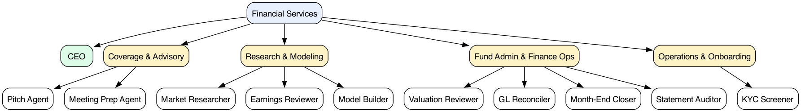

# Financial Services

> **Community port** of [`anthropics/financial-services`](https://github.com/anthropics/financial-services) (Anthropic's "Claude for Financial Services") into the [Agent Companies](https://agentcompanies.io) format. **Not affiliated with or endorsed by Anthropic.** Runtime-agnostic via the Paperclip adapter chain — Claude is the reference runtime; Codex, Gemini, OpenCode, Cursor, and others are supported with varying skill polish.

11 agents — a CEO who handles intake, coordination, and escalation, plus 10 specialists across 4 teams: coverage & advisory, research & modeling, fund admin & finance ops, operations & onboarding. Specialist skills are referenced upstream by pinned commit SHA (not vendored); the CEO's coordination skills are port-original.

## Getting Started

```bash
npx companies.sh add stubbi/companies/financial-services
```

See [Paperclip](https://github.com/paperclipai/paperclip) for more information.

## Org chart



## Agents

| Agent | Team | What it does | Skills |
|---|---|---|---|
| **CEO** | _(top-level, port-original)_ | Front of house — intake triage, cross-team coordination, escalation, weekly summary | 4 |
| **Pitch Agent** | Coverage & Advisory | Comps, precedents, LBO → branded pitch deck, end to end | 11 |
| **Meeting Prep Agent** | Coverage & Advisory | Briefing pack before every client meeting | 4 |
| **Market Researcher** | Research & Modeling | Sector or theme → industry overview, competitive landscape, peer comps, ideas shortlist | 5 |
| **Earnings Reviewer** | Research & Modeling | Earnings call + filings → model update → note draft | 6 |
| **Model Builder** | Research & Modeling | DCF, LBO, 3-statement, comps — live in Excel | 6 |
| **Valuation Reviewer** | Fund Admin & Finance Ops | Ingests GP packages, runs valuation template, stages LP reporting | 4 |
| **GL Reconciler** | Fund Admin & Finance Ops | Finds breaks, traces root cause, routes for sign-off | 4 |
| **Month-End Closer** | Fund Admin & Finance Ops | Accruals, roll-forwards, variance commentary | 5 |
| **Statement Auditor** | Fund Admin & Finance Ops | Audits LP statements before distribution | 3 |
| **KYC Screener** | Operations & Onboarding | Parses onboarding docs, runs the rules engine, flags gaps | 3 |

## Skills (31 referenced upstream + 4 port-original)

Most-shared upstream: `xlsx-author` (8 agents) · `audit-xls` (6) · `pptx-author` (3) · `comps-analysis` (3).

Port-original (CEO-owned, hand-authored in this repo, no upstream counterpart): `intake-triage`, `cross-team-coordination`, `escalation-routing`, `weekly-summary`.

Upstream-referenced `skills/<slug>/SKILL.md` files are thin reference manifests pointing to the pinned-commit file; skill content is fetched on demand by the runtime — nothing is forked or vendored. Port-original `skills/<slug>/SKILL.md` files contain their content inline.

## Boundaries

Nothing in this package constitutes investment, legal, tax, or accounting advice. These agents draft analyst work product (models, memos, research notes, reconciliations) for review by a qualified professional. They do not make investment recommendations, execute transactions, bind risk, post to a ledger, or approve onboarding; every output is staged for human sign-off. You are responsible for verifying outputs and for compliance with the laws and regulations that apply to your firm.

## Provenance

| Field | Value |
|---|---|
| Upstream | [`anthropics/financial-services`](https://github.com/anthropics/financial-services) |
| Pinned commit | `57772c3f1607229fba0270f94abf3c976bbd852f` (2026-05-07) |
| Upstream license | Apache-2.0 |
| Port license | Apache-2.0 (matches upstream) |

See [`NOTICE`](./NOTICE) for full attribution.

## Maintenance — bumping the upstream SHA

```bash
make bump SHA=<new-upstream-sha>
make test
git diff --stat
git commit -am "chore: bump upstream to <short-sha>"
```

`make bump` rewrites `manifest.yaml`, regenerates all 46 manifests, refetches content hashes, and runs `make check`. If any upstream file's content hash has changed, the regenerated SKILL.md reflects it.

## Layout

```
financial-services/
├── COMPANY.md                          # generated
├── teams/<slug>/TEAM.md                # generated, ×4
├── agents/<slug>/AGENTS.md             # generated, ×11 (CEO + 10 specialists)
├── skills/<slug>/SKILL.md              # generated for the 31 upstream-referenced;
│                                       # hand-authored for the 4 port-original
├── manifest.yaml                       # canonical source — edit this, run `make build`
├── scripts/build.py                    # manifest generator (skips port-original SKILL.md)
├── scripts/check.py                    # validator
├── Makefile
├── images/org-chart.png                # generated
├── tests/                              # pytest unit tests for the generator
├── LICENSE                             # Apache-2.0
└── NOTICE                      # upstream attribution
```
