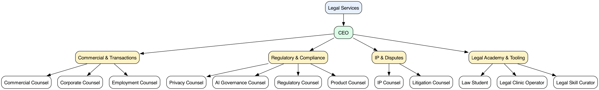

# Legal Services

> **Community port** of [`anthropics/claude-for-legal`](https://github.com/anthropics/claude-for-legal) (Anthropic's "Claude for Legal") into the [Agent Companies](https://agentcompanies.io) format. **Not affiliated with or endorsed by Anthropic.** Runtime-agnostic via the Paperclip adapter chain — Claude is the reference runtime; Codex, Gemini, OpenCode, Cursor, and others are supported with varying skill polish.

13 agents — a CEO who handles intake triage, cross-practice coordination, escalation, and weekly summaries, plus 12 practice-area specialists (one per upstream plugin) across 4 teams. Specialist skills are referenced upstream by pinned commit SHA (not vendored); the CEO's coordination skills are port-original.

> [!IMPORTANT]
> **Every output from these agents is a draft for attorney review — not legal advice, not a legal conclusion, not a substitute for a lawyer.** Source attribution on every citation, conservative defaults on privilege and subjective legal calls, jurisdiction assumptions surfaced explicitly, and explicit gates before anything is filed, sent, signed, or relied on. A licensed attorney reviews, verifies, and takes professional responsibility for anything that leaves the building.

## Getting Started

```bash
npx companies.sh add stubbi/companies/legal-services
```

See [Paperclip](https://github.com/paperclipai/paperclip) for more information.

## Org chart



## Agents

| Agent | Team | What it does | Skills |
|---|---|---|---|
| **CEO** | _(top-level, port-original)_ | Front of house — intake triage, cross-practice coordination, escalation, weekly summary | 4 |
| **Commercial Counsel** | Commercial & Transactions | Vendor / NDA / SaaS reviews against playbook, renewals, escalations, stakeholder summaries | 12 |
| **Corporate Counsel** | Commercial & Transactions | M&A diligence, disclosure schedules, closing checklists, board consents, entity compliance | 13 |
| **Employment Counsel** | Commercial & Transactions | Hires, terminations, worker classification, leaves, investigations, policies, expansion | 20 |
| **Privacy Counsel** | Regulatory & Compliance | DSARs, PIAs, DPA reviews, processing-activity triage, privacy policy drift | 9 |
| **AI Governance Counsel** | Regulatory & Compliance | AI use-case triage, AIAs, vendor-AI review, AI reg gaps, AI policy drift | 10 |
| **Regulatory Counsel** | Regulatory & Compliance | Reg-feed digests, policy diffs, gap tracking, NPRM comments, policy redrafts | 9 |
| **Product Counsel** | Regulatory & Compliance | Launch reviews, "is this a problem?" triage, marketing-claims checks | 7 |
| **IP Counsel** | IP & Disputes | TM clearance, FTO triage, C&D, DMCA, OSS licensing, IP clauses, portfolio | 12 |
| **Litigation Counsel** | IP & Disputes | Matters, demands, subpoenas, chronologies, depo prep, briefs, holds, privilege log | 19 |
| **Law Student** | Legal Academy & Tooling | Socratic drill, case briefs, IRAC, outlines, bar prep | 13 |
| **Legal Clinic Operator** | Legal Academy & Tooling | Clinic setup, student onboarding, intake, deadlines, supervisor-review queue | 16 |
| **Legal Skill Curator** | Legal Academy & Tooling | Discover, evaluate, and gate-install community legal skills | 10 |

## Skills (150 referenced upstream + 4 port-original)

The 12 upstream plugins each ship their own copy of `cold-start-interview`, `customize`, and `matter-workspace` — each customized to its practice area — and a few skill slugs (`use-case-triage`, `reg-gap-analysis`, `policy-monitor`) appear in two plugins with distinct content. To preserve these as separate skills, every upstream-referenced skill in this package is namespaced by its plugin: `<plugin>--<bare-slug>` (e.g., `commercial-legal--review`, `privacy-legal--use-case-triage`).

Port-original (CEO-owned, hand-authored in this repo, no upstream counterpart): `intake-triage`, `cross-practice-coordination`, `escalation-routing`, `weekly-summary`.

Upstream-referenced `skills/<slug>/SKILL.md` files are thin reference manifests pointing to the pinned-commit file; skill content is fetched on demand by the runtime — nothing is forked or vendored. Port-original `skills/<slug>/SKILL.md` files contain their content inline.

## Boundaries

Nothing in this package constitutes legal advice. Every output is a draft for attorney review — not a legal conclusion, not a substitute for a lawyer. These agents draft work product (memos, redlines, claim charts, deposition outlines, review reports, policies, classifications) for review by a qualified attorney. They do not file briefs, send demand letters, issue legal holds, or take positions on behalf of any party; every output is staged for human sign-off. The attorney using the package — not the package, and not Anthropic — is responsible for the legal positions taken in their work product.

In particular:

- **Privilege.** Agents never decide whether a communication is privileged. They flag privilege questions for attorney review and default to the more-conservative posture when ambiguous.
- **Jurisdiction.** Agents surface jurisdiction assumptions explicitly; they do not resolve choice-of-law questions on the user's behalf.
- **Send / file / sign / settle authority.** Agents never send a demand letter, file a brief, sign a board consent, issue a legal hold, settle a matter, or attest to anything on the user's behalf. Every such action is gated on attorney sign-off.
- **Regulator-imposed deadlines.** Any matter with a regulator-imposed deadline inside 72 hours escalates to a human attorney regardless of whether the agent has a draft ready.

## Provenance

| Field | Value |
|---|---|
| Upstream | [`anthropics/claude-for-legal`](https://github.com/anthropics/claude-for-legal) |
| Pinned commit | `9cecd91b0f26f732d18315afc3c9bb5ff99e0fbb` (2026-05-12) |
| Upstream license | Apache-2.0 |
| Port license | Apache-2.0 (matches upstream) |

See [`NOTICE`](./NOTICE) for full attribution and a list of upstream features deferred from v0.1.0 (per-plugin scheduled-agent `.md` files, the top-level `managed-agent-cookbooks/` directory, the MCP server inventory).

## Maintenance — bumping the upstream SHA

```bash
make bump SHA=<new-upstream-sha>
python -m scripts.extract_upstream_metadata > /tmp/legal-skills-block.yaml  # regenerate skill names + descriptions
# review and splice into manifest.yaml's `skills:` block (after the four CEO port-original entries)
make build
make check
git diff --stat
git commit -am "chore: bump upstream to <short-sha>"
```

`make bump` rewrites the upstream commit pin in `manifest.yaml` and reruns `make build` + `make check`. If any upstream file's content hash has changed, the regenerated `SKILL.md` reflects it. If upstream added or removed a skill, the extractor helper produces a fresh skill block for you to splice in.

## Layout

```
legal-services/
├── COMPANY.md                          # generated
├── teams/<slug>/TEAM.md                # generated × 4
├── agents/<slug>/AGENTS.md             # generated × 13 (CEO + 12 specialists)
├── skills/<slug>/SKILL.md              # generated × 150 upstream-referenced;
│                                       # hand-authored × 4 port-original
├── manifest.yaml                       # canonical source — edit this, run `make build`
├── scripts/build.py                    # manifest generator (skips port-original SKILL.md)
├── scripts/check.py                    # validator
├── scripts/extract_upstream_metadata.py  # one-shot helper for bumping upstream
├── Makefile                            # build / check / test / bump / clean
├── images/org-chart.png                # generated
├── tests/                              # pytest unit tests for the generator
├── LICENSE                             # Apache-2.0
└── NOTICE                              # upstream attribution + deferred-feature note
```
